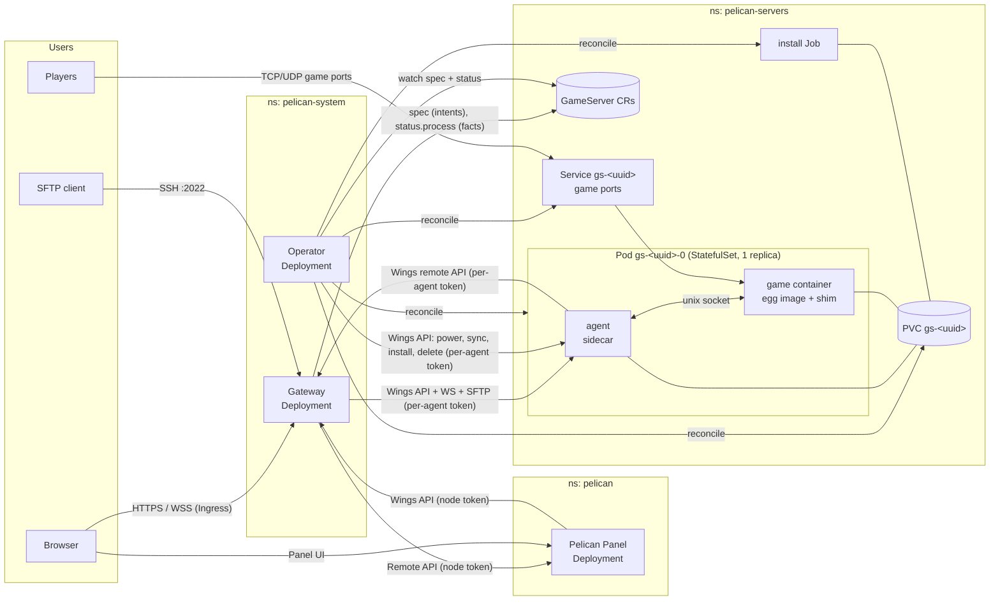
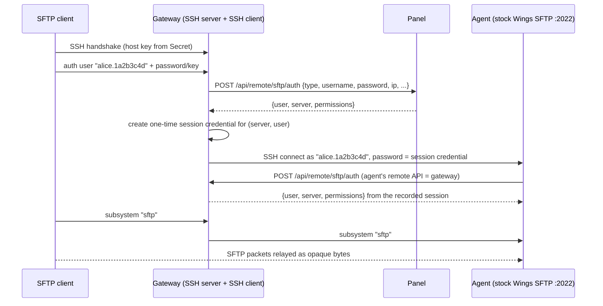
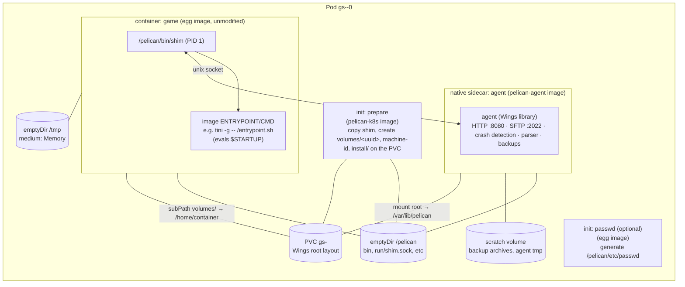
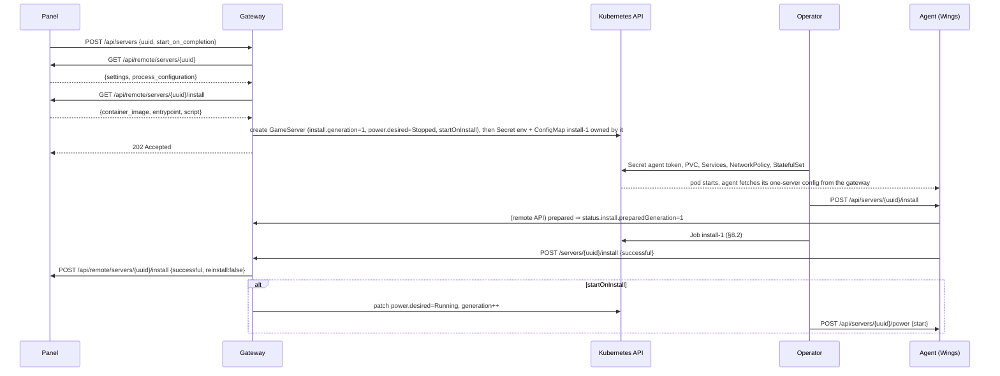
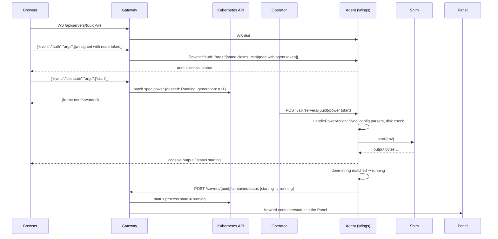

# pelican-k8s — Kubernetes-native backend for Pelican Panel

| | |
|---|---|
| **Status** | Draft v0.4: architecture proposal, nothing implemented |
| **Date** | 2026-09-15 |
| **Target** | Any conformant Kubernetes ≥ 1.35 (in-place pod resize stable, native sidecars, ValidatingAdmissionPolicy), single- or multi-node |
| **Upstream basis** | Pelican Wings `65422ff`, Pelican Panel `6ba5264` (see [`docs/wings-panel-contract.md`](docs/wings-panel-contract.md)) |
| **Working name** | `pelican-k8s` (placeholder; CRD group `pelican-k8s.io` is also a placeholder) |

---

## 1. Summary

Pelican Panel manages game servers through **Wings**, a per-host daemon that drives Docker. This
document proposes replacing Wings with three Kubernetes-native components. **The Panel and the eggs
stay completely unmodified.**

| Component | Kind | One-line role |
|---|---|---|
| **Gateway** | Deployment (stateless; only live websocket and SFTP connections are per-replica) | Presents itself to the Panel as a single Wings node and holds the node token. Translates Panel intents into `GameServer` spec changes, records observed process state in the status, and proxies data-path traffic (files, console, SFTP, backups) to the right agent |
| **Operator** | Deployment (controller) | The only reconciler. Turns one `GameServer` into a StatefulSet (1 replica), PVC, Services, NetworkPolicy and install Jobs, and drives the agent (power, config sync, install, destroy) until the process matches the spec |
| **Agent** | Native sidecar container in every game pod | Wings as a Go library, one server per instance. Runs Wings' stock router, websocket, SFTP server, filesystem, config parser, crash detection and backup code unchanged, and drives the game process through the shim |
| **Shim** | Static binary injected as the game container's entrypoint | Supervises the egg's process inside the unmodified egg image: PTY/stdin, signals, exit codes, cgroup stats |

The core idea: **one game server = one pod + one PVC + one CR.** Wings' logic moves next to the
data (agent). The Panel protocol is terminated centrally (gateway). Kubernetes owns scheduling,
storage, networking and restarts (operator).

---

## 2. Goals and non-goals

### Goals

1. **Unmodified Panel.** Panel code, database schema and eggs stay untouched. The Panel sees an ordinary
   Node (`scheme://fqdn:port` plus SFTP port and token).
2. **Kubernetes-native workloads.**
   - Every server is a resource you can inspect and debug with `kubectl`. Cluster policy
     (`GameServerClass`) is GitOps-managed; server specs are owned by the Panel through the gateway.
   - Pods are owned by controllers, not created imperatively.
   - One PVC per server, so storage moves with the pod.
3. **Wings feature parity** for the day-to-day feature set:
   - power control, console and stats
   - file manager, uploads and downloads, SFTP
   - egg installs and reinstalls, egg config-file rewriting, startup "done" detection
   - crash detection and auto-restart
   - backups (local and S3) and restore
   - activity log, suspension
4. **Restricted-shape game pods by default.** Game pods run as a pinned non-root UID with no host
   access, all capabilities dropped and the `RuntimeDefault` seccomp profile, i.e. they satisfy the
   `restricted` Pod Security Standard. Because install Jobs must run as root in the same namespace, the
   namespace itself is labelled `baseline`, and the restricted shape of game pods is enforced by a
   `ValidatingAdmissionPolicy` bound to their ServiceAccount (§12.2). Anything needing more is opt-in.
5. **Wings as an unmodified dependency** (MIT), imported as a Go module, to inherit its behaviour and
   edge-case handling. The few pluggability hooks the agent needs are proposed upstream as opt-in
   refactors with the Docker path as default (§6.3).
6. **No single-node assumption** in the design.

### Non-goals (v1)

- High availability of the **Panel** or the **gateway** (single replica each is fine; §14 covers the HA path).
- **Server transfers** between nodes. A single gateway is a single Panel Node, so there is nothing to
  transfer to (§17 covers the future path).
- Panel **mounts** (host path mounts), `force_outgoing_ip`, swap, `io_weight`, CPU pinning
  (`threads`), and disabling the OOM killer. §16 explains each.
- Session-based matchmaking or fleets.
- Upstreaming changes to the Panel.

---

## 3. Background

### 3.1 How Wings works today (condensed)

Details and citations: [`docs/wings-panel-contract.md`](docs/wings-panel-contract.md).

- **One daemon per host** that creates **one Docker container per server**:
  - host port = container port on both TCP and UDP
  - the server directory `/var/lib/pelican/volumes/<uuid>` is bind-mounted at `/home/container`
  - UID forced to 988, read-only root filesystem, `/tmp` as tmpfs
- **Everything else Wings does reads the host disk directly:** SFTP server, file manager API, disk quotas,
  tar.gz backups, install scripts (run as root in a separate container) and egg config-file rewriting.
- **Console:** Docker attach (stdin/stdout), relayed to the browser over a JWT-authenticated websocket.
- **JWTs are HS256 signed with the node token.** Revocation and one-time-token state lives in memory.
- **Scheduling is Panel-side** (Laravel queue plus cron). Wings has no scheduler.

### 3.2 Alternatives within the Pelican ecosystem

| Approach | Why rejected |
|---|---|
| **PR pelican/wings#193**: Kubernetes environment backend inside Wings | Wings creates bare pods imperatively (`RestartPolicy: Never`, no owner), keeps state in memory, and needs one shared data PVC mounted by Wings plus every game pod (`data_pvc` + `subPath`) for files and SFTP to work. Per-server PVCs disable the file manager. That is a Docker host emulated on Kubernetes |
| **Wings as a DaemonSet** (one Panel Node per Kubernetes node) | DaemonSets cannot template per-pod PVCs; each pod needs its own Panel identity and FQDN (hostPort); game pods stay pinned to their node with no failover |
| **kubectyl/kuber** (archived 2024): Wings fork creating bare pods via the Kubernetes API | Needed a forked Panel; per-server SFTP pods because the daemon had no filesystem access; `RestartPolicy: Never` pods so crash handling had to be reimplemented; NodePort-only allocations |
| **Full rewrite of Wings** | Very high effort; loses Wings' battle-tested file, SFTP and parser semantics |

This design keeps the Panel contract, reuses Wings' server-local logic, and puts Kubernetes in charge
of the workload.

---

## 4. Architecture overview



### 4.1 Namespaces

| Namespace | Contents |
|---|---|
| `pelican` | Panel (web + queue worker + scheduler), database, optional Redis |
| `pelican-system` | Gateway, operator, gateway Secrets (node token, SFTP host key) |
| `pelican-servers` | `GameServer` CRs and everything they own, including two Secrets per server (egg variables, agent token) readable only by the gateway and operator |

v1 uses one server namespace. Per-tenant namespaces are a later option (§17).

### 4.2 Design principles

1. **The node token never leaves the gateway.** It signs every browser JWT for every server, so any
   process holding it can impersonate the node. Game pods run arbitrary egg code and must never see it.
2. **Terminate user traffic centrally, execute locally.** The gateway authenticates Panel and browser
   traffic and routes it. File I/O, process control, parsing, per-server token checks, revocation and
   rate limiting happen in the agent, next to the PVC, with Wings' own code.
3. **Intents go into the spec, facts go into the status, one controller closes the loop.**
   - The gateway is the only writer of `spec`: Panel settings become `spec.panel`, power actions become
     `spec.power`, installs become `spec.install`. It also records what agents report in
     `status.process`.
   - The operator is the only reconciler. It compares spec with status and acts, on Kubernetes objects
     and on the agent's Wings API alike. Nothing else issues power, sync or install calls.
   - `spec.power.desired` replaces Wings' `states.json` and follows the same rule: `Running` on
     `start`/`restart`, `Stopped` when the process reaches `offline` through `stopping` (power
     `stop`/`kill`, the stop command typed into the console, suspension). A crash leaves it at
     `Running`, so Wings' crash handler and pod recreation both restore a running server, and a server
     stopped from the console stays stopped after a node reboot.
4. **Wings' code, Kubernetes' plumbing.** The agent is a small `main` that imports Wings as a module,
   registers a shim-backed environment and a Job-backed installer through upstream hooks, and otherwise
   runs Wings' stock router, websocket and SFTP server. No Wings code is copied or patched.
5. **Container port = external port = Panel allocation port** in every exposure mode, so `SERVER_PORT`
   and what players connect to always agree.

---

## 5. Gateway

A Go service in `pelican-system`. It imports Wings packages for the request and response types,
`router/tokens`, `remote` (Panel HTTP client and API types) and the SFTP algorithm and host key code.

### 5.1 Responsibilities

1. Implement the **node-facing Wings HTTP API** toward the Panel (node-token auth, `User-Agent` response header).
2. Terminate **browser traffic** (websockets, signed download and upload URLs) and **SFTP**, verify it
   against the node token, and hand it to the right agent under that agent's own token (§5.4).
3. Translate **server lifecycle** calls (create, sync, install, power, delete) into `GameServer` **spec**
   changes. The gateway never calls an agent to change state; that is the operator's job (§7.6).
4. Serve the **Wings remote API** to agents: each agent sees a Panel with exactly one server, and the
   gateway forwards only what belongs to that server (§5.7).
5. Record **observed process state** in `status.process` from the agents' `container/status` posts,
   and serve the Panel's latency-sensitive reads (`GET /api/servers/:s` has a 1 s timeout) from a short
   per-replica cache.
6. Answer **node-level** endpoints (`/api/system*`, list servers) from cluster data and configuration.

The gateway holds no revocation, replay or session-registry state. Wings' denylist, one-time token
store and boot cutoff run inside each agent for its own server. The only per-replica state is the set
of live websocket and SSH connections, so replicas are interchangeable (§14).

### 5.2 Route handling

Server-scoped routes are proxied **by prefix**: anything under `/api/servers/:s/` that the gateway does
not intercept is forwarded to the agent unchanged, so new Wings routes work without a gateway change.

| Route(s) | Handling at gateway |
|---|---|
| `POST /api/update` | Accept and ignore (config comes from Helm/GitOps). Respond like Wings with `ignore_panel_config_updates` |
| `GET /api/system` | Synthesize: gateway version, `os: linux`, kernel and arch of the gateway pod, cluster version. Docker fields filled with placeholders so the Panel UI shows a version instead of an exception |
| `GET /api/diagnostics` | Gateway diagnostics: Panel reachability, CR counts, agent reachability summary |
| `GET /api/system/docker/disk` | `{}` zeros |
| `DELETE /api/system/docker/image/prune` | `{"ImagesDeleted": null, "SpaceReclaimed": 0}` |
| `GET /api/system/ips` | Configured list of advertised IPs (the exposure mode's external IPs, §9.3) |
| `GET /api/system/utilization` | Totals from configured capacity (namespace `ResourceQuota` if present, else node allocatable), usage from CR status |
| `GET /api/servers` | List from CRs plus the state cache |
| `POST /api/servers` | Server create flow (§8.1): spec only |
| `POST /api/deauthorize-user` | Forward to the agents of the listed servers (all agents if `servers` is empty, which also covers the Panel payload-wrapping bug). Wings in each agent denylists the user and closes that user's websocket and SFTP sessions, which ends the gateway's relayed connections |
| `DELETE /api/transfers/:s`, `POST /api/transfers` | `501`-style error with a clear message (transfers unsupported in v1) |
| `GET /api/servers/:s` | From the state cache (agent `GET /api/servers/:s` polled on demand, 2 s TTL). If the agent is unreachable, the last known state is served while the pod exists; `missing` if it does not (the Panel's own value for an unreachable node) |
| `DELETE /api/servers/:s` | Delete the CR (§8.8) |
| `POST /api/servers/:s/sync` | Re-fetch the Panel configuration, update `spec.panel` and the env Secret (§8.6) |
| `POST /api/servers/:s/install`, `/reinstall` | Fetch the install payload, create the script ConfigMap, bump `spec.install.generation` (§8.2) |
| `POST /api/servers/:s/power` | Patch `spec.power` (§8.3); `202` |
| `POST/DELETE /api/servers/:s/transfer` | Unsupported in v1 |
| `POST /api/servers/:s/commands`, `/ws/deny`, `GET /logs`, `/install-logs`, `/files/*`, `/backup*`, anything else under `/api/servers/:s/` | Proxy to the agent with the agent token |
| `GET /api/servers/:s/ws` | Websocket proxy (§5.5) |
| `GET /download/file`, `/download/backup`, `POST /upload/file` | Verify the JWT with the node token, re-sign it with the agent token of the `server_uuid` claim (§5.4), proxy to that agent, which runs Wings' scope, expiry, one-time and denylist checks |

**Response headers:** every response carries `User-Agent: Pelican Wings/v<compat-version> (id:<token_id>)`.
The advertised version is configurable, because the Panel may gate features on the Wings version.

### 5.3 Routing to agents

- Each server has a headless Service `gs-<uuid>-agent` exposing the agent's HTTP port (8080) and SFTP
  port (2022) inside the pod.
- The gateway resolves it through EndpointSlices (informer cache), not DNS. A server whose agent
  container is not started gets a fast `503 {"error": "server pod unavailable"}` instead of a timeout.

### 5.4 Per-agent tokens and JWT re-signing

Every agent is a complete Wings instance with its **own** `token_id.token`, generated by the operator into
Secret `gs-<uuid>-agent` (§7.4). The gateway and operator read it; it is mounted only into the agent
container. The node token never leaves the gateway.

| Direction | Mechanism |
|---|---|
| Gateway/operator → agent HTTP API | `Authorization: Bearer <agent token>`, exactly how the Panel talks to Wings. Wings' `RequireAuthorization` middleware runs unchanged |
| Agent → gateway (remote API) | `Authorization: Bearer <token_id>.<token>` from the agent's own Wings `remote` client. The gateway maps the token to the server (§5.7) |
| Browser JWTs (websocket `auth`, signed URLs) | Signed by the Panel with the node token. The gateway **verifies** the HS256 signature with the node token, then **re-signs the same claims** (`iat`, `exp`, `jti`, `unique_id`, `server_uuid`, `user_uuid`, `permissions`, scope) with the agent token of the target server. Wings in the agent then validates the token as if it had come from the Panel: scope, `exp`, one-time `unique_id`, `(server, user)` denylist and boot cutoff all run there |

Because claims are preserved, revocation semantics are Wings': a `deauthorize-user` rejects tokens
issued before it, and an agent restart rejects tokens issued before the restart (the Panel UI fetches
a fresh one on `token expired`), the same as a Wings restart today. A compromised agent can mint
tokens for its own server only.

### 5.5 Websocket proxy

The gateway proxies frames and understands the `{event, args}` format only far enough to find `auth`:

1. **Upgrade checks:** `Origin` equals the Panel URL or one of `allowed_origins`; a suspended server (from
   the CR) is closed with code 4409 before dialing. Everything else (30 connections per server, the
   inbound limiters, per-message token revalidation, permissions) is Wings code in the agent.
2. **Dial** the agent's `/api/servers/<uuid>/ws`.
3. **Inbound `auth` frames:** verify the JWT with the node token, re-sign it with the agent token
   (§5.4), forward. Invalid signature ⇒ reply `jwt error`, do not forward.
4. **All other frames in both directions** pass through unchanged. `token expiring`, `token expired`,
   `throttled` and permission errors come from the agent.

### 5.6 SFTP relay



- SSH has no SNI, so the target server is only known after authentication. The gateway terminates the
  client's SSH session, authenticates against the Panel, then acts as an SSH client toward the agent's
  **stock Wings SFTP server**. Permission checks, denylist file rules, disk quota and SFTP activity
  logging all stay Wings code.
- The agent's host key is pinned by fingerprint on first connection and recorded in
  `status.agent.sftpHostKey`; the gateway's own host key is a stable ED25519 key in Secret
  `pelican-gateway-sftp-hostkey`. Wings' algorithm pinning and `MaxAuthTries` apply on both hops.
- `key_only` and `read_only` are gateway and agent settings respectively. SFTP activity rows carry the
  gateway's IP as the client address, since the agent sees the gateway's connection.

### 5.7 Wings remote API served to agents

The agent's Wings `remote` client points at the gateway's internal listener. The gateway authenticates
the `token_id.token`, maps it to a server, and answers as a Panel that owns exactly that server:

| Agent call | Gateway behaviour |
|---|---|
| `GET /servers?page=` | One-item list: `{settings, process_configuration}` assembled from `spec.panel` and the `gs-<uuid>-env` Secret |
| `GET /servers/{uuid}` | Same object; `404` for any other UUID |
| `POST /servers/reset` | Acknowledged and dropped (§8.9 covers the node-level reset) |
| `POST /servers/{uuid}/container/status` | Write `status.process.state` immediately; derive `spec.power.desired=Stopped` when `previous_state` is `stopping` and `new_state` is `offline` (§4.2); forward to the Panel |
| `POST /servers/{uuid}/install` | Forward to the Panel when `spec.install.generation` is in progress; record `status.install.result` |
| `POST /activity` | Forward rows whose `server` is the caller; drop the rest |
| `GET /backups/{b}?size=`, `POST /backups/{b}`, `POST /backups/{b}/restore` | Forward when `b` is in `status.backups.pending` for the caller (learned from the proxied `POST /api/servers/:s/backup`) |
| `POST /sftp/auth` | Answer from the gateway's own SFTP session records (§5.6); never forwarded |
| transfers | `404` |

The gateway's allowlist is diffed against Wings' `remote` client in CI (§18), so a new upstream call
fails the build instead of failing at runtime; unmatched calls are also logged and counted.

### 5.8 State cache

`GET /api/servers/:s` and the list endpoint are served from a per-replica cache filled by polling the
agent's own `GET /api/servers/:s` (state plus utilization) on demand with a 2 s TTL. State *changes*
arrive through `container/status` (§5.7) and go to `status.process` at once; utilization goes to
`status.usage` throttled (≤ 1/min) for `kubectl` visibility. Nothing here needs to survive a restart.

---

## 6. Agent and shim

### 6.1 Pod layout



### 6.2 PVC layout

The PVC root **is** a Wings `root_directory` for one server, so Wings path logic works unchanged:

```
/ (PVC root, mounted in agent at /var/lib/pelican)
├── volumes/<uuid>/        # server files → game container /home/container (subPath)
├── logs/                  # agent logs, install/<uuid>.log, console run logs
├── install/<generation>/  # install Job status: output.log, exit-code
├── wings.db               # activity SQLite (unsent rows survive restarts)
└── machine-id             # stable per-server machine-id (subPath → /etc/machine-id)
```

The game container mounts **only** `volumes/<uuid>`, so a game process cannot read activity, logs,
backups or install state.

The `prepare` init container runs as the pod UID with the PVC root mounted and creates
`volumes/<uuid>`, `install/`, `logs/` and the `machine-id` file **before** any container mounts them
as `subPath`. Kubelet creates a missing `subPath` target itself, as a root-owned directory, which
would make `/home/container` unwritable for the pinned UID and turn `/etc/machine-id` into a
directory. Backup archives (local adapter output and S3 upload temp files) do **not** live on the
PVC; they go to the pod's scratch volume (§10.1).

### 6.3 Agent = Wings as a library

`cmd/agent` is a Go `main` in this repository that imports `github.com/pelican/wings` as a module and
runs the parts of Wings' boot sequence that do not touch Docker: `config.Set`, the `remote` client (base
URL = gateway, §5.7), the activity database, `server.NewManager` (which fetches the one-server list
from the gateway), the cron scheduler, `sftp.New` and `router.Configure`. It then adds three routes of
its own to the returned Gin engine and serves on `:8080`:

| Agent-only route | Caller | Purpose |
|---|---|---|
| `GET /internal/v1/healthz` | kubelet | startup and liveness probe (Wings' `/api/system` needs Docker) |
| `POST /internal/v1/prestop` | kubelet `preStop` hook | run Wings' stop procedure for the process and return when it is offline (§6.4) |
| `POST /internal/v1/exit-state {code, oomKilled}` | operator | inject the exit state when the shim died with the process (§6.4) |

Everything else the agent serves is Wings' stock router: power, commands, files, backups, websocket,
signed downloads and uploads, `deauthorize-user`, `ws/deny`, and the SFTP server on `:2022`.

**What the agent provides through upstream hooks** (all in this repository):

| Hook | Our implementation |
|---|---|
| Environment factory | `environment/shim`: a `ProcessEnvironment` talking to the shim socket (§6.4) |
| Installer | Job-backed installer: takes Wings' install lock, reports `prepared`, tails `install/<gen>/output.log` and `exit-code` written by the Job, writes `logs/install/<uuid>.log` in Wings' format, calls `POST /servers/{uuid}/install` on the remote API (§8.2) |

**Upstream changes required in Wings**, each an opt-in refactor that leaves the Docker path as the
default and changes no behaviour for existing installations:

| # | Change | Where |
|---|---|---|
| 1 | Environment factory: `server.Manager` takes an optional `func(*server.Server) environment.ProcessEnvironment`; default `docker.New` | `server/manager.go` `InitServer` |
| 2 | Replace the `*docker.Environment` type assertions with small interfaces (`ImageAndStopConfigurable`, `Attachable`) | `server/update.go`, `router/websocket/websocket.go` |
| 3 | Installer interface: `Server.Install()` delegates to a pluggable installer; default is the Docker installer | `server/install.go` |
| 4 | Export the boot helpers that live under `internal/` (activity database initialisation, cron scheduler) or move them out of `internal` | `internal/database`, `internal/cron` |

Until these merge, `go.mod` carries a `replace` directive pointing at a branch with the four patches.
The milestones (§19) do not gate on the merges, and every Wings release runs the route-table and
remote-client diffs from §18.

**Configuration** (`pelican-agent-config` ConfigMap plus the token Secret): `token_id`/`token` from
`WINGS_TOKEN_ID`/`WINGS_TOKEN`, `remote: http://pelican-gateway.pelican-system.svc:8081`,
`api.host: 0.0.0.0`, `api.port: 8080`, `system.sftp.bind_port: 2022`, `check_permissions_on_boot: false`,
`system.user.rootless.enabled: true`, `log_directory: /var/lib/pelican/logs`,
`backup_directory: /scratch/backups`, `tmp_directory: /scratch/tmp`, `enable_log_rotate: false`,
`passwd.enable: false`, `docker.network.interface: 0.0.0.0` (§9.4). The agent never auto-starts a server at
boot; the operator does that from `spec.power` (§7.6).

**What stays pure Wings:**
- `server/filesystem` (safe path resolution, denylist, disk usage, soft quota)
- the file routes, compress and decompress, remote file pull (with Wings' private-range SSRF block)
- the router, token validation, one-time store, denylist and cutoff
- the websocket handler and listeners, done detection, egg config parsers, crash detection
- the SFTP server and handler
- backup adapters (local, S3 multipart via the Panel) and restore
- activity DB and crons

### 6.4 Shim

A small static Go binary (≈ 1–2 kLOC). The operator copies it into an emptyDir with an init container
and sets it as the game container's `command`.

**Why a shim:**
- Wings' Docker model recreates the container on every start and attaches to its stdin.
- In a pod, restarting a container restarts only that container, but a *stopped* server must keep its pod
  (files, SFTP, websocket, stats), and Kubernetes cannot stop a single container.
- So the shim is PID 1 and stays alive; the game process is its child.

**Responsibilities:**
- Listen on `/pelican/run/shim.sock` (mode 0600; both containers run as the same UID, §12.2).
- `start{env}`: spawn the **image's original ENTRYPOINT+CMD** in a PTY, with `STARTUP`, `SERVER_*` and
  egg variables in the environment, and `cwd=/home/container`. The argv is the container's own `args`,
  which the operator resolved from the image config (§7.5); the agent supplies only the environment.
  This preserves yolk entrypoint behaviour (e.g. SteamCMD auto-update logic in `/entrypoint.sh`).
- `stdin{bytes}`, `signal{name}` (to the process group), `kill`.
- **Output:** stream PTY bytes to the connected agent, keep a ring buffer (default 1 MiB) so an agent
  restart doesn't lose context, and **tee to container stdout** so `kubectl logs -c game` works.
- `exited{code}` when the child exits.
- **OOM:** on cgroup v2, kubelet sets `memory.oom.group=1` for every container (Kubernetes ≥ 1.28), so an
  OOM kills the whole container cgroup, shim included, and kubelet restarts the container. The shim
  therefore never reports OOM itself. The operator watches the game container's
  `lastState.terminated` (`reason: OOMKilled`, exit code) and posts it to the agent's
  `/internal/v1/exit-state`; the shim environment turns it into `exited{code, oomKilled: true}` and
  the agent runs Wings' crash handling on it. The ring buffer is lost
  in this case. When a restarted container's shim socket reappears, the agent reconnects and, if the
  crash rules allow, starts the process again. Nodes with kubelet `singleProcessOOMKill: true`
  (Kubernetes ≥ 1.32) kill only the game process; there the shim reports `exited{code, oomKilled}`
  from the `oom_kill` counter delta in `/sys/fs/cgroup/memory.events` and the ring buffer survives.
- **SIGTERM** (pod deletion, eviction, drain): kubelet runs the game container's `preStop` hook first,
  which calls the agent's `/internal/v1/prestop`; the agent runs Wings' regular stop procedure (stop
  command or signal, `WaitForStop`, then terminate) and returns once the process is offline. Only then
  does the shim receive SIGTERM, which it treats as `kill` for anything still running, and exits. The
  agent is a native sidecar (§7.5), so it is terminated only after the game container has exited.
- **Stats:** every 2 s from its own cgroup (`memory.current`, `memory.max`, `cpu.stat`, `io.stat`) and
  `/proc/net/dev` (pod network namespace). Pushed to the agent.
- **Hygiene:** clean `/tmp` before each start (emulates the Docker per-start tmpfs); never exit while the
  socket is open.

**Implementation mapping to Wings' `ProcessEnvironment`:**

| Method | Shim-based behaviour |
|---|---|
| `Attach` | Connect to the socket, subscribe to output; `exited` ⇒ `SetState(offline)` (drives Wings crash detection) |
| `Start` | Truncate the run log, `starting`, `OnBeforeStart` (may request pod recreate, §8.5), `start{env}` |
| `Stop` | Stop type `signal` ⇒ `signal{}` (Wings' mapping, unknown ⇒ SIGKILL); type `command` ⇒ `stdin{value+"\n"}` |
| `WaitForStop` / `Terminate` | Poll shim status; SIGKILL on timeout |
| `SendCommand` | `stdin{}` (sets `stopping` first if it equals the stop command, as Wings does) |
| `Readlog(n)` | Tail of `logs/console-current.log` (agent-written), falling back to the shim ring buffer |
| `ExitState` | From the shim's `exited{}`, or from the operator's `/internal/v1/exit-state` post after an OOM |
| `IsRunning`, `Uptime` | Shim status |
| `InSituUpdate` | Resource changes are applied by the operator (in-place pod resize); no-op |
| `Create`, `Destroy`, `Exists` | Trivial (pod lifecycle belongs to the operator) |

**Agent restart:** the agent container restarts but the game keeps running. The agent reconnects, gets
status `running` with the ring buffer, and re-attaches. That is better than Wings, where a daemon restart
re-attaches to Docker.

---

## 7. `GameServer` custom resource and operator

### 7.1 Spec (v1alpha1)

```yaml
apiVersion: pelican-k8s.io/v1alpha1
kind: GameServer
metadata:
  name: gs-1a2b3c4d-5e6f-4a7b-8c9d-0e1f2a3b4c5d   # "gs-" + server uuid
  namespace: pelican-servers
  labels:
    pelican-k8s.io/server-uuid: 1a2b3c4d-5e6f-4a7b-8c9d-0e1f2a3b4c5d
    pelican-k8s.io/egg-uuid: 9f8e...
  annotations:
    pelican-k8s.io/panel-name: "Survival SMP"
spec:
  # --- mirrored from the Panel (written by the gateway, never edited by hand) ---
  panel:
    uuid: 1a2b3c4d-5e6f-4a7b-8c9d-0e1f2a3b4c5d
    uuidShort: 1a2b3c4d
    # The raw `settings` object from GET /api/remote/servers/{uuid}, minus `environment`
    # (x-kubernetes-preserve-unknown-fields). The agent consumes it unchanged as its Wings server
    # configuration; the operator reads only suspended, container.image, build.*, allocations.*.
    settings:
      id: 1
      meta: {name: "Survival SMP", description: ""}
      suspended: false
      invocation: "java -Xms128M -Xmx{{SERVER_MEMORY}}M -jar {{SERVER_JARFILE}}"
      skip_egg_scripts: false
      build: {memory_limit: 4096, swap: 0, io_weight: 500, cpu_limit: 200, threads: null, disk_space: 10240, oom_killer: true}
      container: {image: ghcr.io/pelican-eggs/yolks:java_21, requires_rebuild: false}
      allocations:
        force_outgoing_ip: false
        default: {ip: "0.0.0.0", port: 25565}   # servers without allocation: {ip: 127.0.0.1, port: 0} and mappings {"": []}
        mappings: {"0.0.0.0": [25565, 25575]}
      egg:
        id: 9f8e...
        file_denylist: []
        features: {eula: ["You need to agree to the EULA"]}   # feature id → console listener strings
      labels: {}
    # Egg variables (may contain credentials) live in a Secret, not in the CR.
    environmentSecretRef: {name: gs-1a2b3c4d-5e6f-4a7b-8c9d-0e1f2a3b4c5d-env}
    processConfiguration:   # raw process_configuration, x-kubernetes-preserve-unknown-fields
      startup: {done: [")! For help, type "], user_interaction: [], strip_ansi: false}
      stop: {type: command, value: stop}
      configs: [...]
    panelRevision: "sha256:…"   # hash of the settings + process_configuration payload last applied

  # --- desired process state (§4.2; written by gateway, kubectl-editable, reconciled by the operator) ---
  power:
    desired: Running          # Running | Stopped
    generation: 3             # bump with desired=Running ⇒ restart; the operator acts once per generation
    kill: false               # with desired=Stopped: SIGKILL instead of the stop procedure
    restartRequest: 0         # bump to force pod recreate at next safe point

  # --- install requests (written by gateway) ---
  install:
    generation: 1             # bump ⇒ operator runs a new install Job once the agent has prepared (§8.2)
    reinstall: false
    scriptConfigMap: gs-1a2b3c4d-install-1
    image: ghcr.io/pelican-eggs/installers:debian
    entrypoint: bash

  # --- cluster-side policy (defaults from GameServerClass; admin-editable) ---
  className: default
```

`settings.build.memory_limit` and `cpu_limit` may be `0` (unlimited in the Panel); the class supplies
the resources used in that case (§7.3, §11).

### 7.2 Status

```yaml
status:
  observedGeneration: 7
  phase: Running            # Pending | Installing | Stopped | Starting | Running | Stopping | Suspended | Error
  process:                  # written by the gateway from the agent's container/status posts
    state: running          # offline | starting | running | stopping
    since: "2026-09-15T18:02:11Z"
    lastExit: {code: 0, oomKilled: false, at: "…"}   # from the shim, or from the container status after an OOM
  power:                    # written by the operator
    observedGeneration: 3   # spec.power.generation last acted on
    lastAction: {action: start, at: "…", podUID: "…"}
  agent:
    podUID: "…"             # pod whose agent the operator last drove; a new UID means "fresh pod"
    sftpHostKey: "SHA256:…" # pinned by the gateway on first SFTP connection (§5.6)
  usage:                    # throttled (≤ 1/min) summary for kubectl
    memoryBytes: 2147483648
    cpuPercent: 37.5
    diskBytes: 5368709120
  install:
    observedGeneration: 1
    preparedGeneration: 1   # written via the gateway when the agent holds the install lock for this generation
    result: Succeeded       # Succeeded | Failed | Running
    finishedAt: "…"
  backups:
    pending: [ {uuid: "…", startedAt: "…"} ]
  endpoints:
    - {ip: "203.0.113.10", port: 25565, protocols: [TCP, UDP]}
  podImage: ghcr.io/pelican-eggs/yolks:java_21@sha256:…
  conditions:
    - type: VolumeReady          # PVC bound (and expanded to requested size)
    - type: ExposureReady        # Service has endpoints / external IP
    - type: AgentReady           # agent container started (startup probe) and answers its Wings API
    - type: InstallPrepared      # agent stopped the process and holds the install lock for spec.install.generation
    - type: Installed
    - type: ResizePending        # in-place resize deferred/infeasible
    - type: RecreatePending      # image/pod-template change waiting for offline
    - type: NodeLost             # pod stuck Terminating on a NotReady node (§14)
```

### 7.3 `GameServerClass` (cluster-side defaults)

Admin-owned, cluster-scoped. Referenced by `spec.className`, with the default class set by the gateway.

```yaml
apiVersion: pelican-k8s.io/v1alpha1
kind: GameServerClass
metadata: {name: default}
spec:
  storage:
    storageClassName: standard  # must allow volume expansion
    defaultSizeGiB: 20          # used when disk_space = 0
    overheadPercent: 10         # PVC = disk_space × 1.10 (logs, wings.db, install output)
    scratch:                    # backup archives and agent temp files (§10.1)
      type: Ephemeral           # Ephemeral (generic ephemeral volume, storageClassName below) | EmptyDir
      storageClassName: standard
      sizeGiB: 0                # 0 = size of the server PVC (an archive can be as large as the server)
    deletionPolicy: Delete      # Delete | Retain | SnapshotThenDelete
    volumeSnapshotClassName: ""  # required for SnapshotThenDelete / snapshotSchedule
  exposure:
    mode: LoadBalancer          # LoadBalancer | NodePort (single-node clusters only) | HostPort
    externalTrafficPolicy: Local
    loadBalancer:               # implementation-specific annotation keys
      ipAnnotation: ""          # pins the Service to the allocation IP
      sharingAnnotation: ""     # lets several Services share one IP
  network:
    inClusterEgress:            # destinations inside the cluster that game pods may reach (§12.4)
      gameServers: true         # other GameServer pods on their allocation ports (proxies such as Velocity)
      additional: []            # e.g. [{cidr: 10.43.0.0/16, ports: [9000]}] for an in-cluster S3
  resources:
    memoryOverheadMultiplier: 1.05   # Wings docker.overhead default
    cpuRequestPercentOfLimit: 25     # overcommit knob
    unlimitedMemoryMiB: 4096         # used when memory_limit = 0
    unlimitedCpuPercent: 0           # used when cpu_limit = 0; 0 = no limit, request = minCpu
    minCpu: 100m
    tmpSizeMiB: 100
    agent: {cpu: 50m, memory: 128Mi, memoryLimit: 512Mi}
  security:
    runAsUser: 1000              # pinned non-root UID and GID (install Jobs chown to it)
    generatePasswdEntry: true
  install:
    serviceAccountName: pelican-installer
    resources: {cpu: "1", memory: 1Gi}  # Wings installer_limits default
    strictExitCode: false        # Wings ignores install script exit codes
    activeDeadlineSeconds: 3600
  failover:
    forceDeleteAfter: ""         # e.g. 5m: force-delete a pod stuck Terminating on a NotReady node (§14). Empty = never
  imageResolution:
    registryLookup: false        # true: resolve ENTRYPOINT/CMD from the registry (needs egress + pullSecrets)
    pullSecrets: [pelican-registries]
    entrypointOverrides:         # glob → argv; checked first
      "ghcr.io/pelican-eggs/yolks:*": ["/usr/bin/tini", "-g", "--", "/entrypoint.sh"]
```

### 7.4 Owned resources

| Resource | Name | Notes |
|---|---|---|
| PersistentVolumeClaim | `gs-<uuid>` | RWO, size = `disk_space × (1+overhead)`, expanded online on change (the StorageClass must support volume expansion). **Not** owned via ownerReference when `deletionPolicy: Retain` |
| Secret | `gs-<uuid>-env` | Egg variables (`settings.environment`); created by the gateway, owned by the CR. Read by the gateway (served to the agent as part of its Wings configuration, §5.7) and used via `envFrom` by install Jobs |
| Secret | `gs-<uuid>-agent` | The agent's own Wings `token_id` and `token` (§5.4); generated by the operator, owned by the CR, mounted only into the agent container, read by the gateway and operator |
| StatefulSet | `gs-<uuid>` | `replicas: 1`, `updateStrategy: OnDelete` (the operator decides when the pod restarts), explicit PVC volume (no `volumeClaimTemplates`, so resizing works). StatefulSet guarantees at most one pod, so an RWO volume is never double-mounted |
| Service (exposure) | `gs-<uuid>` | One port entry per allocation port for each of TCP and UDP (mixed protocols are GA). Type per class. `publishNotReadyAddresses: true`, so player traffic never depends on container readiness |
| Service (agent) | `gs-<uuid>-agent` | Headless, agent HTTP (8080) and SFTP (2022) ports, `publishNotReadyAddresses: true`; reachability is decided by the callers from container status and call results |
| NetworkPolicy | `gs-<uuid>` | Ingress on this server's game ports from anywhere; agent port from the gateway only (§12.4) |
| ConfigMap | `gs-<uuid>-install-<gen>` | Install script; created by the gateway after the CR exists, owned by the CR |
| Job | `gs-<uuid>-install-<gen>` | Install run (§8.2) |
| VolumeSnapshot | `gs-<uuid>-<ts>` | Optional (§10.4) |

### 7.5 Pod template (abridged)

```yaml
spec:
  automountServiceAccountToken: false
  serviceAccountName: pelican-game            # or pelican-game-hostport (HostPort mode)
  enableServiceLinks: false
  terminationGracePeriodSeconds: 660          # > Wings' 10-min stop wait; spent in the preStop hooks
  securityContext:
    runAsNonRoot: true
    runAsUser: <class runAsUser>               # pinned: prepare init and install Jobs chown to it
    runAsGroup: <class runAsUser>
    fsGroup: <class runAsUser>
    fsGroupChangePolicy: OnRootMismatch
    seccompProfile: {type: RuntimeDefault}
  initContainers:
    - name: prepare
      image: registry/pelican-k8s/shim:<ver>
      # copies the shim; creates volumes/<uuid>, install/, logs/ and the machine-id file on the PVC root
      command: ["/shim", "prepare", "--bin", "/pelican/bin/shim", "--data", "/data", "--uuid", "<uuid>"]
      volumeMounts:
        - {name: pelican, mountPath: /pelican}
        - {name: data, mountPath: /data}
    - name: probe-entrypoint                     # egg image; resolves argv when no override/registry result exists
      image: <settings.container.image>
      command: ["/pelican/bin/shim", "probe", "--out", "/pelican/etc/argv", "--passwd", "/pelican/etc/passwd", "--name", "container", "--home", "/home/container"]
      volumeMounts: [{name: pelican, mountPath: /pelican}]
    - name: agent                                # native sidecar: starts before and stops after the game container
      restartPolicy: Always
      image: registry/pelican-k8s/agent:<ver>
      args: ["--config", "/etc/pelican/config.yml"]
      ports: [{name: agent, containerPort: 8080}, {name: sftp, containerPort: 2022}]
      startupProbe: {httpGet: {path: /internal/v1/healthz, port: agent}}
      livenessProbe: {httpGet: {path: /internal/v1/healthz, port: agent}, failureThreshold: 6}
      lifecycle:
        preStop: {httpGet: {path: /internal/v1/prestop, port: agent}}   # returns once the process is offline
      env:
        - {name: PELICAN_SERVER_UUID, valueFrom: {fieldRef: {fieldPath: "metadata.labels['pelican-k8s.io/server-uuid']"}}}
        - {name: PELICAN_POD_IMAGE, value: <settings.container.image>}
        - {name: WINGS_TOKEN_ID, valueFrom: {secretKeyRef: {name: gs-<uuid>-agent, key: token_id}}}
        - {name: WINGS_TOKEN, valueFrom: {secretKeyRef: {name: gs-<uuid>-agent, key: token}}}
      securityContext: {allowPrivilegeEscalation: false, readOnlyRootFilesystem: true, capabilities: {drop: [ALL]}}
      volumeMounts:
        - {name: data, mountPath: /var/lib/pelican}
        - {name: scratch, mountPath: /scratch}
        - {name: pelican, mountPath: /pelican/run, subPath: run}
        - {name: agent-config, mountPath: /etc/pelican, readOnly: true}
  containers:
    - name: game
      image: <settings.container.image>@<digest>   # re-resolved at every pod (re)creation, like Wings' pull-on-start
      command: ["/pelican/bin/shim", "run", "--socket", "/pelican/run/shim.sock", "--argv-file", "/pelican/etc/argv", "--"]
      args: <argv from entrypointOverrides or registry lookup; empty ⇒ shim reads /pelican/etc/argv>
      stdin: false                              # stdin is owned by the shim PTY
      ports: <allocation ports, TCP+UDP>        # containerPort = allocation port (+ hostPort in HostPort mode)
      resources:
        requests: {memory: <memoryLimit>Mi, cpu: <limit × request%>}
        limits:   {memory: <memoryLimit × multiplier>Mi, cpu: <cpuLimit/100>}
      resizePolicy:
        - {resourceName: cpu, restartPolicy: NotRequired}
        - {resourceName: memory, restartPolicy: NotRequired}
      lifecycle:
        preStop: {httpGet: {path: /internal/v1/prestop, port: 8080}}   # agent runs the Wings stop procedure first
      securityContext:
        allowPrivilegeEscalation: false
        readOnlyRootFilesystem: true
        capabilities: {drop: [ALL]}
      env: [{name: HOME, value: /home/container}, {name: USER, value: container}]
      volumeMounts:
        - {name: data, mountPath: /home/container, subPath: volumes/<uuid>}
        - {name: data, mountPath: /etc/machine-id, subPath: machine-id, readOnly: true}
        - {name: pelican, mountPath: /pelican/bin, subPath: bin, readOnly: true}
        - {name: pelican, mountPath: /pelican/etc, subPath: etc, readOnly: true}
        - {name: pelican, mountPath: /pelican/run, subPath: run}
        - {name: pelican, mountPath: /etc/passwd, subPath: etc/passwd, readOnly: true}   # if generated
        - {name: tmp, mountPath: /tmp}
  volumes:
    - {name: data, persistentVolumeClaim: {claimName: gs-<uuid>}}
    - {name: pelican, emptyDir: {}}
    - {name: tmp, emptyDir: {medium: Memory, sizeLimit: <tmpSizeMiB>Mi}}
    - name: scratch                               # class storage.scratch: generic ephemeral volume or emptyDir
      ephemeral: {volumeClaimTemplate: {spec: {accessModes: [ReadWriteOnce], storageClassName: <class>, resources: {requests: {storage: <size>}}}}}
    - {name: agent-config, configMap: {name: pelican-agent-config}}
```

**Egg environment.** The game process gets its environment from the agent (`start{env}`, built by Wings'
`Environment()` from the server configuration, which the gateway assembles from `spec.panel` and the
`gs-<uuid>-env` Secret). Nothing egg-specific appears in the pod spec.

**Image entrypoint resolution.** The shim is the container entrypoint, so the operator must know the
image's original `ENTRYPOINT`+`CMD`. Resolution order:
1. class `entrypointOverrides` (glob on the image reference);
2. registry lookup with `go-containerregistry` and the class pull secrets, if `registryLookup` is on;
3. otherwise the `probe-entrypoint` init container, running in the egg image itself, checks for the
   yolk convention (`/entrypoint.sh`, executed with `/bin/bash`) and writes the argv to
   `/pelican/etc/argv`, which the shim reads when it receives no argv after `--`. The same init
   container writes the generated passwd entry.

The pod is pinned to the digest the tag resolved to when the pod was created, and re-resolved on every
recreate, which matches Wings pulling the tag before each start. A `~` prefix on the image (Wings:
"never pull") disables digest pinning and sets `imagePullPolicy: IfNotPresent`.

### 7.6 Reconcile rules

The operator is the only component that acts on a `GameServer`. It reconciles two kinds of state: the
Kubernetes objects it owns, and the process inside the pod, which it drives through the agent's stock
Wings HTTP API (`Authorization: Bearer <agent token>`, §5.4).

**Resources**

| Change | Operator action |
|---|---|
| `build.memory_limit/cpu_limit` | Patch the pod's `resize` subresource (in-place resize is stable in Kubernetes 1.35). If the result is `Infeasible` or `Deferred`, set `ResizePending` and apply at the next recreate |
| `build.disk_space` | Expand the PVC (never shrink; a shrink sets a condition) |
| `allocations` | Update the exposure Service and NetworkPolicy. No pod change: `containerPort` is informational for Services, and `SERVER_PORT` is applied by Wings' sync at the next start. HostPort mode is the exception and marks `RecreatePending` |
| `container.image` | Update the StatefulSet template (OnDelete) and set `RecreatePending`. The pod is deleted only when the process is `offline` (§8.5) |
| `power.restartRequest` bump | Delete the pod once the process is offline |
| Game container terminated (`lastState.terminated`, e.g. `OOMKilled`) | `POST /internal/v1/exit-state` to the agent (§6.4) |
| Pod `Terminating` on a `NotReady` node longer than `failover.forceDeleteAfter` | Force-delete the pod so the StatefulSet can reschedule it (§14) |
| CR deleted | Finalizer (§8.8): stop or destroy via the agent, apply `deletionPolicy` (§10.3), remove owned resources |

**Process** (each row is one call to the agent; the response is recorded in `status`)

| Spec or status change | Operator action |
|---|---|
| `spec.power.generation` ≠ `status.power.observedGeneration` | `desired: Running` ⇒ `POST /power {start}`, or `{restart}` if the process is `running`. `desired: Stopped` ⇒ `POST /power {stop}`, or `{kill}` if `kill: true`. Then record `observedGeneration` |
| Fresh pod (`status.agent.podUID` ≠ current pod, agent startup probe passed) | Record the pod; if `desired: Running`, `POST /power {start}` (Wings' "was running before reboot" behaviour). Otherwise nothing |
| `spec.panel.panelRevision` changed, or the `gs-<uuid>-env` Secret changed | `POST /sync`: the agent re-fetches its configuration from the gateway (§5.7) and runs Wings' `SyncWithConfiguration`, which also stops a suspended server. The gateway independently closes that server's websockets with 4409 |
| `spec.install.generation` > `status.install.observedGeneration` | `POST /install` (or `/reinstall` when `spec.install.reinstall`); the agent's installer takes the install lock and reports `prepared`. Once `status.install.preparedGeneration` matches, create the Job (§8.2) |
| Suspended server, `spec.panel.settings.suspended: true` | Covered by the sync rule. Optional class flag `suspendScalesToZero` deletes the pod afterwards |

**What the operator deliberately does not do:** restart a process that is `offline` while
`desired: Running` without a spec change or a fresh pod. Crash restarts, and the rule that gives up when
the previous crash was less than 60 s ago, are Wings' crash handler inside the agent. An operator
that restarted on every `offline` would defeat that suppression and produce a hot loop.

---

## 8. Key flows

Every flow follows the same shape: the **gateway** turns a Panel or browser request into a spec change
(or proxies a data-path request), the **operator** reconciles spec against status by calling the
**agent's** Wings API, and the agent reports facts back through its remote API, which the gateway
records in the status.

### 8.1 Create server



`start_on_completion` is stored as `spec.install.startOnInstall`; the gateway turns it into a power
intent when the install result arrives.

### 8.2 Install and reinstall

1. **Trigger.** Panel `POST /install` or `/reinstall` (or create). The gateway fetches the install
   payload, creates ConfigMap `gs-<uuid>-install-<gen+1>`, and patches `spec.install`.
2. **Operator calls the agent:** `POST /api/servers/:s/install` or `/reinstall` (Wings returns `202`
   and runs the installer asynchronously; `/reinstall` answers `409` while a power action is running,
   which the operator retries).
3. **Agent prepares** (our installer implementation behind the upstream hook, §6.3):
   - reinstall ⇒ `WaitForStop(10s, terminate)` (Wings semantics)
   - take the installing lock, run SFTP `CancelAll`, publish `install started`
   - start tailing `install/<gen>/output.log`
   - report `prepared` through the remote API; the gateway writes `status.install.preparedGeneration = <gen>`.
     **The operator creates no Job before this**, so the script never runs while the process is alive.
     If the agent does not report within a class timeout, the operator marks the install failed and
     the gateway reports that to the Panel.
4. **Operator runs the Job:**
   - `podAffinity` to the server pod (`kubernetes.io/hostname`), so RWO volumes attach on any cluster size
   - ServiceAccount `pelican-installer`, root (§12.2); `automountServiceAccountToken: false`;
     resources = max(server, class install resources); `activeDeadlineSeconds`
   - init container `prepare` (as in the game pod) copies the shim into an emptyDir
   - mounts: PVC `volumes/<uuid>` → `/mnt/server`, PVC `install/<gen>` → `/pelican/install`,
     ConfigMap → `/mnt/install/install.sh`, shim → `/pelican/bin`
   - egg variables via `envFrom` the `gs-<uuid>-env` Secret, plus `SERVER_*` and `STARTUP` as Wings sets them
   - command: `shim install-run --log /pelican/install/output.log --exit /pelican/install/exit-code --chown <uid>:<uid> -- <entrypoint> /mnt/install/install.sh`.
     After the script, the shim `chown -R`s `/mnt/server` to the class UID, so root-created files are writable.
5. **Completion.** When `exit-code` appears (or the Job reaches a terminal state, which the operator
   writes to `status.install.result`), the installer writes `logs/install/<uuid>.log` in Wings' format
   (so `GET /install-logs` works), publishes `install completed`, sets `offline`, and posts
   `POST /servers/{uuid}/install {successful, reinstall}` to the remote API. The gateway forwards it to
   the Panel. Success is `true` unless `strictExitCode` is set and the exit code is non-zero, or the Job
   failed or timed out.
6. **Cleanup.** The operator records `status.install.observedGeneration` and deletes the Job
   (`ttlSecondsAfterFinished`).

### 8.3 Start, stop and console



- **`set state` frames** and Panel `POST /power` calls become `spec.power` patches: `start` ⇒
  `{desired: Running, generation++}`, `restart` ⇒ the same (the operator issues `restart` when the
  process is running), `stop` ⇒ `{desired: Stopped, kill: false}`, `kill` ⇒ `{desired: Stopped, kill: true}`.
  The gateway does not forward `set state` frames to the agent; Wings' permission checks for them
  (`control.start`, `control.stop`, `control.restart`) are evaluated by the gateway from the token's
  `permissions` claim before patching. Everything else on the websocket (`send command`, `send logs`,
  `send stats`) passes through to the agent.
- **Stop:** Wings stop logic (`command` or `signal`), `WaitForStop(10 min, terminate)`. The process goes
  `stopping` → `offline`; the gateway sees that transition in `container/status` and sets
  `power.desired=Stopped` if it is not already. The same happens when the stop command is typed into
  the console or the server is suspended, exactly the transitions Wings excludes from crash detection.
- **Crash:** `exited` (from the shim, or injected by the operator after an OOM) ⇒ agent `offline` ⇒
  Wings `handleServerCrash` ⇒ auto-restart (within timeout rules). `power.desired` stays `Running`
  and the operator does not intervene (§7.6).

### 8.4 Files, downloads and uploads

- **Panel file API calls** (`/files/*`): Panel → gateway (node token) → agent (agent token) → Wings
  filesystem on the PVC.
- **Signed URLs:** browser → gateway `/download/file?token=…` → gateway verifies the signature with the
  node token, re-signs the claims with the agent token of `server_uuid` → agent runs Wings' scope,
  expiry, one-time and denylist checks and streams the file. Uploads likewise (`upload_limit` enforced
  by the agent's Wings config; the Ingress body limit must match).
- **Remote pull** (`/files/pull`): the agent downloads. Egress rules and Wings' private-range block both apply.

### 8.5 Image change (deferred pod recreate)

Wings applies a new image at the next start by recreating the container. Equivalent flow:

1. Panel `sync` ⇒ gateway updates `spec.panel.settings.container.image` ⇒ operator updates the
   StatefulSet template and sets `RecreatePending`.
2. If the process is `offline`, the operator deletes the pod immediately. Otherwise it waits: on the next
   `spec.power` change to `Stopped`, or when the process reaches `offline`, it deletes the pod.
   A `start` while `RecreatePending` is set is executed as "delete the pod, then start in the new
   one": the operator does not issue `POST /power {start}` to the old pod.
3. The new pod's agent comes up; the fresh-pod rule (§7.6) issues `start` if `desired: Running`.
4. The browser sees `starting` → a short websocket reconnect (`daemon message: applying new image`,
   emitted by the gateway) → `running`.

### 8.6 Sync (Panel edits a server)

1. Panel `POST /api/servers/:s/sync`.
2. Gateway: `GET /api/remote/servers/{uuid}` → update `spec.panel` (and `panelRevision`) and the
   `gs-<uuid>-env` Secret. `202`.
3. Operator (sync rule, §7.6): `POST /api/servers/:s/sync` on the agent. Wings re-fetches
   `GET /servers/{uuid}` from its remote API, which the gateway serves from the CR and the Secret, then
   runs `SyncWithConfiguration` and `SyncWithEnvironment`. If suspended, Wings stops the server and
   cancels SFTP sessions; the gateway closes that server's websockets with 4409.
4. Operator: reconciles resources per §7.6.

### 8.7 Backups and restore

| Adapter | Flow |
|---|---|
| **wings** (local) | Agent writes `/scratch/backups/<uuid>/<backup>.tar.gz` on the pod's scratch volume (§10.1), never on the server PVC. Download via gateway `/download/backup` → agent. The scratch volume is deleted with the pod, so this adapter is for single-node, non-durable use only; the Panel's per-server backup limit bounds its size |
| **s3** (recommended) | Agent generates the archive on the scratch volume → remote API `GET /backups/{b}?size=` (gateway forwards) → Panel presigned part URLs → **agent PUTs directly to S3** → `POST /backups/{b}` via the gateway → temp file removed. An in-cluster S3 needs an `inClusterEgress.additional` entry in the class (§12.4) |

- Backups and restores are imperative Wings actions proxied by the gateway (`POST /backup`,
  `POST /backup/:b/restore`, `DELETE /backup/:b`), not reconciled state.
- **Restore:** Panel → gateway → agent. The agent runs Wings' `RestoreBackup` (S3 `download_url` fetched
  by the agent) and reports through the remote API.
- The gateway records `status.backups.pending` on create so the remote-API check in §5.7 can pass, and
  clears it on completion.

### 8.8 Delete server

1. Panel `DELETE /api/servers/:s`. The gateway deletes the CR and answers `204`.
2. Operator finalizer, by `deletionPolicy`:
   - `Delete`: `DELETE /api/servers/:s` on the agent. Wings kills the process, publishes `deleted`,
     cancels sessions and removes the server directory (and local backups, matching
     `remove_backups_on_server_delete`). Then delete the PVC and the other owned resources.
   - `Retain`: `POST /power {kill}` on the agent, delete the StatefulSet and Services, orphan the PVC
     (label `pelican-k8s.io/orphaned-at`). Wings' `DELETE` is not called, because it would wipe the data.
   - `SnapshotThenDelete`: as `Retain`, then create a VolumeSnapshot with the class's
     `volumeSnapshotClassName`, wait `ReadyToUse`, delete the PVC.
3. Websocket and SFTP sessions end when the agent container stops.

### 8.9 Pod or node restart

- **Pod deleted** (eviction, drain, operator recreate): the `preStop` hooks run Wings' stop procedure
  through the agent before any container receives SIGTERM (§6.4), so worlds are saved. The agent, a
  native sidecar, stops last. `spec.power.desired` is untouched by this path.
- **Pod recreated** (after eviction, node reboot, operator recreate): the agent boots and fetches its
  configuration from the gateway. It does not start anything on its own. The operator's fresh-pod rule
  (§7.6) issues `start` if `desired: Running` (Wings' "was running before reboot" behaviour) and does
  nothing if `Stopped`.
- **Agent container restart only:** the shim keeps the game alive and the agent re-attaches (§6.4). The
  pod UID is unchanged, so the operator does not issue a start. Tokens issued before the restart are
  rejected by Wings' boot cutoff in the agent; the Panel UI fetches fresh ones.
- **Gateway restart or rollout:** live websocket and SSH connections on that replica drop and clients
  reconnect; no state is lost, because the gateway keeps none (§5.1). `POST /api/remote/servers/reset`
  clears `installing` and `restoring_backup` for **every** server on the node, and installs and restores
  here outlive the gateway, so the gateway sends `reset` only once no CR has an install or restore in
  progress; until then it re-checks on every completion. On a fresh node with no servers it is sent
  immediately.
- **Operator restart:** reconcile is idempotent; `status.power.observedGeneration` and
  `status.agent.podUID` prevent duplicate power actions.

---

## 9. Networking

### 9.1 Gateway HTTP (Wings API, websocket, signed URLs)

- Exposed through an **Ingress** or a Gateway API **HTTPRoute** with TLS termination, e.g.
  `wings.example.com` → Service `pelican-gateway:8080`.
- Ingress timeouts must allow:
  - request/read timeout **≥ 16 min** (Panel compress and decompress calls wait up to 15 min)
  - long idle timeouts for **websockets** (hours)
  - request bodies up to the upload limit (100 MiB default)
- Panel Node settings:

  | Field | Value |
  |---|---|
  | FQDN | `wings.example.com` |
  | Scheme | `https` |
  | Behind proxy | yes |
  | `daemon_listen` | 8080 |
  | `daemon_connect` | 443 |

- The Panel reaches the gateway through the same external address (it uses `getConnectionAddress()`
  for everything), so the gateway FQDN must be resolvable from the Panel pod.

### 9.2 SFTP

TCP, so it can't go through an HTTP ingress.

| Mode | Panel node fields |
|---|---|
| NodePort | `daemon_sftp` = nodePort (e.g. 30022), `daemon_sftp_alias` = node DNS name |
| LoadBalancer | `daemon_sftp` = 2022, `daemon_sftp_alias` = LB DNS name |

### 9.3 Game ports: exposure modes

Invariant: **container port = service port = external port = Panel allocation port.**

| Mode | How | Privileges | Client IP | Panel allocations |
|---|---|---|---|---|
| **LoadBalancer** (default) | Service `type: LoadBalancer`; the class's implementation-specific annotations pin the allocation IP and allow IP sharing; `externalTrafficPolicy: Local` | none | preserved | IP = LB pool IP(s), any port 1024–65535. Works on any cluster size: the LB follows the pod |
| **NodePort** | Service `type: NodePort`, `nodePort` = allocation port, `externalTrafficPolicy: Local` | none | preserved (Local) | IP = node IP; **ports must be in the NodePort range** (30000–32767 by default) and unique across the cluster, i.e. use **one allocation IP**. **Single-node clusters only:** with `Local` the allocation IP serves traffic only while the pod runs on that node, so the operator refuses this mode when the cluster has more than one schedulable node |
| **HostPort** | `hostPort` = allocation port on the game container | namespace must be `privileged` (Pod Security `baseline` rejects any `hostPort`; §12.2) | preserved | IP = node IP; pods must land on the node owning the IP (single node only, or add per-IP node affinity) |

- `GET /api/system/ips` returns the class-configured external IPs, so the Panel's allocation dropdown matches the mode.
- **LoadBalancer** is the default because it is the only mode that keeps the allocation IP valid when a
  pod moves between nodes, and it allows "natural" game ports such as 25565. It needs a LoadBalancer
  implementation (cloud, MetalLB, kube-vip). **NodePort** needs nothing extra and is the choice for
  single-node clusters.

### 9.4 `SERVER_IP` inside the pod

Wings passes the allocation IP as `SERVER_IP`, and many eggs write it into config files as the bind
address. Inside a pod the node or LB IP is not bindable. The agent therefore:
- exports `SERVER_IP=0.0.0.0` and `INTERNAL_IP=<pod IP>`
- presents `allocations.default.ip = 0.0.0.0` to the egg config parser
- keeps the real IP available as `SERVER_PUBLIC_IP` for eggs that advertise it
- sets Wings' `docker.network.interface` to `0.0.0.0`, so egg config values that use the
  `{{config.docker.interface}}` placeholder (the Docker bridge gateway, `172.18.0.1` under Wings) resolve
  to a bindable address as well. Wings' rewrite of a `127.0.0.1` default allocation to that interface
  therefore also yields `0.0.0.0`.
- servers without an allocation (`default: 127.0.0.1:0`, `mappings: {"": []}`) get no exposure Service
  and `SERVER_PORT=0`, as under Wings.

This must be validated per egg (§19).

---

## 10. Storage

### 10.1 Volumes

- One PVC per server from the class StorageClass (RWO, must support volume expansion).
- **Size** = `disk_space × (1 + overheadPercent)`, or the class default when unlimited. The overhead
  covers logs, the activity database and install output only.
- **Two limits apply:**
  - *soft*: Wings' filesystem accounting (writes through the file API and SFTP, plus the periodic scan
    that stops the server when over the limit)
  - *hard*: the PVC size
- **Scratch volume** (class `storage.scratch`): a generic ephemeral volume (or emptyDir) mounted in the
  agent at `/scratch`, holding Wings' `backup_directory` and `tmp_directory`. A backup archive can be as
  large as the server itself, so it must not compete with the server's own quota; the default scratch
  size equals the server PVC size. It is created and deleted with the pod.

### 10.2 Expansion

Online expansion via PVC resize, if the CSI driver supports expanding attached volumes; otherwise it
takes effect at the next pod recreate. Shrinking is refused and surfaced as a condition.

### 10.3 Deletion policy

See §8.8. The default is `Delete` (Panel semantics). `SnapshotThenDelete` is the safer choice for
production.

### 10.4 Snapshots and disaster recovery

- **Prerequisite:** a CSI driver with snapshot support, the snapshot controller, and a VolumeSnapshotClass
  named in the `GameServerClass`.
- Optional class field `snapshotSchedule` (cron) makes the operator take a VolumeSnapshot per server.
  These are **crash-consistent** and invisible to the Panel; they are infrastructure DR, not Panel backups.

### 10.5 Panel backups

Use the **S3 adapter** in the Panel, pointed at a dedicated bucket. Archives are then durable
independent of the pod, and downloads are presigned by the Panel. The local `wings` adapter stores
archives on the pod's scratch volume, which does not survive pod recreation.

---

## 11. Resource mapping

| Panel `build` | Wings/Docker | Kubernetes (game container) |
|---|---|---|
| `memory_limit` (MiB) | `MemoryReservation` = limit; `Memory` = limit × overhead | `requests.memory` = limit; `limits.memory` = limit × `memoryOverheadMultiplier`. `0` (unlimited) ⇒ class `unlimitedMemoryMiB` is used for both, and `SERVER_MEMORY` reports it |
| `cpu_limit` (%) | `CPUQuota` = % × 1000 | `limits.cpu` = %/100; `requests.cpu` = limits × `cpuRequestPercentOfLimit`, at least `minCpu`. `0` ⇒ class `unlimitedCpuPercent`; if that is also 0, no limit and request = `minCpu` |
| `disk_space` (MiB) | soft quota | soft quota (agent) + PVC size |
| `swap` | `MemorySwap` | **not supported** (§16) |
| `io_weight` | `BlkioWeight` | **not supported** |
| `threads` | `CpusetCpus` | **not supported** (would need static CPU manager) |
| `oom_killer: false` | `OomKillDisable` | **not supported**: OOM kills always happen; reported as `oomKilled` |
| PIDs (`container_pid_limit` 512) | `PidsLimit` | kubelet `podPidsLimit` (node-level setting) |
| OOM detection | `OOMKilled` from container inspect | container status `lastState.terminated.reason` relayed by the operator (§6.4) |
| tmpfs `/tmp` (100 MiB) | tmpfs | `emptyDir{medium: Memory, sizeLimit}` (counts toward memory) |
| installer limits | max(server, installer_limits) | Job resources = max(server, class install resources) |

**Agent overhead:** the agent container has its own requests and limits (§7.3), accounted separately
from the game, unlike Wings' overhead multiplier. The limit must leave room for Wings' compress,
decompress and archive code paths on large servers; the class default is 512 MiB.

---

## 12. Security

### 12.1 Trust boundaries and credentials

| Credential | Held by | Never in |
|---|---|---|
| Node daemon token (`token_id.token`) | Gateway Secret | agents, game pods, install Jobs, operator |
| Per-agent Wings token (Secret `gs-<uuid>-agent`) | Agent container (env), gateway and operator (read) | game container, install Jobs, CR |
| SFTP host key (gateway) | Gateway Secret | pods |
| Egg variables (Secret `gs-<uuid>-env`; may hold tokens and passwords) | Gateway (serves them to the agent), install Job (`envFrom`), game process environment | CR spec, ConfigMaps, pod specs of the game pod |
| Panel S3 credentials | Panel | agents (they only get presigned URLs) |

**Blast radius of a compromised game process** (arbitrary egg code, RCE in a game):
- it can read and modify its own server files
- it can use the pod's network egress (limited by NetworkPolicy)
- it can connect to the shim socket in `/pelican/run`, but that only controls its own process;
  the agent is a client of that socket and exposes nothing on it
- it **cannot** reach the Panel remote API, other servers' agents, the Kubernetes API (no token), or the
  node token

A compromised **agent** container holds its own Wings token. It can mint browser tokens for its own
server, and it can act as its own server toward the Panel through the gateway's remote-API allowlist
(status, activity, install result, its own pending backups). It cannot reach other servers' agents
(NetworkPolicy), the Panel directly, the Kubernetes API, or the node token.

### 12.2 Pod security

Pod Security Admission works per namespace and its exemptions apply to the *requesting* identity,
which for controller-created pods is the StatefulSet or Job controller, never the pod's
ServiceAccount. Game pods and install Jobs must share `pelican-servers` (a PVC cannot be mounted
across namespaces), and install scripts assume root (`apt`, `apk`, `chown`). The namespace is
therefore labelled **`baseline`** (`privileged` only in HostPort mode), and the restricted shape of
game pods is enforced by admission policy bound to their ServiceAccount:

| Workload | ServiceAccount | Enforced shape | Enforced by |
|---|---|---|---|
| Game pod | `pelican-game` | `restricted`: `runAsNonRoot`, pinned non-root UID/GID, `fsGroup`, drop ALL, no added capabilities, seccomp `RuntimeDefault`, `allowPrivilegeEscalation: false`, no host namespaces, no `hostPort`, only PVC/emptyDir/ephemeral/projected/configMap volumes | `ValidatingAdmissionPolicy` `pelican-game-restricted` (CEL, GA since Kubernetes 1.30) matched on `spec.serviceAccountName`, shipped by the Helm chart |
| Game pod, HostPort mode | `pelican-game-hostport` | as above plus `hostPort` = allocation ports | same policy with a `hostPort` allowance; namespace at `privileged`, since `baseline` rejects any `hostPort` |
| Install Job | `pelican-installer` | `baseline`: root allowed, no privilege escalation, no host access, no added capabilities beyond the image defaults | namespace PSA level plus a `ValidatingAdmissionPolicy` restricting volumes to the server PVC, the script ConfigMap and emptyDirs |
| Gateway, operator | own SAs | `restricted` | PSA on `pelican-system` |

- On OpenShift the same split maps onto SecurityContextConstraints bound to the three ServiceAccounts
  (`restricted-v2` for `pelican-game`, `anyuid` for `pelican-installer`, a custom SCC for `hostPort`).
- **UID pinning:** the class supplies `runAsUser`, used as UID, GID and `fsGroup`; the `prepare` init
  container and install Jobs `chown` to it. On platforms that assign a UID range per namespace and reject
  pinned UIDs outside it, the operator reads the namespace's range and uses its start instead.

### 12.3 RBAC

| Component | Permissions |
|---|---|
| Gateway | `pelican-servers`: get/list/watch/create/update/patch/delete `gameservers`, `gameservers/status`, `configmaps`, `secrets` (`gs-*-env` create/update; `gs-*-agent` get; both constrained to the `gs-` prefix by admission policy); get/list/watch `pods`, `endpointslices`, `services`. Cluster: get/list `nodes` (for `/api/system/ips`, utilization and the NodePort single-node check) |
| Operator | `pelican-servers`: full on `statefulsets`, `pods` (get/list/watch, delete incl. force, `resize`), `persistentvolumeclaims`, `services`, `networkpolicies`, `jobs`, `volumesnapshots`, `events`; `secrets` (`gs-*-agent` create/get); get `configmaps`; `gameservers` (+status, finalizers). Cluster: get/list/watch `gameserverclasses`, `nodes`; get `namespaces` |
| Game, installer SAs | none. No ServiceAccount token is mounted anywhere in the game pod or the install Job |

### 12.4 NetworkPolicies

- **`pelican-servers` default deny** (ingress and egress).
- **Per server:**
  - ingress on its allocation ports (TCP/UDP) from `0.0.0.0/0`, preserved client IPs thanks to
    `externalTrafficPolicy: Local`
  - ingress on the agent ports (8080 HTTP, 2022 SFTP) from `pelican-system` gateway and operator pods only
- **Egress for game pods and install Jobs:**
  - DNS to the cluster DNS
  - `0.0.0.0/0` **except** the cluster pod CIDR, the service CIDR, node and LAN ranges (configurable),
    and link-local
  - plus the class `network.inClusterEgress` allowances: other GameServer pods on their allocation ports
    (proxy eggs such as Velocity or Bungeecord in front of backend servers) and explicit
    `additional` CIDR/port pairs (in-cluster S3, database, or mod-repository services)
- **Egress for agents:** the above plus the gateway Service (remote API listener).
- **`pelican-system`:** the gateway accepts from the ingress controller, the SFTP exposure and agents
  (remote API), and egresses to the Panel, agents and the API server. The operator egresses to agents
  and the API server.
- Kubelet probes and hooks (`startupProbe`, `livenessProbe`, `preStop` httpGet) originate from the node;
  most CNIs allow host-to-local-pod traffic implicitly. Where one does not, the per-server policy also
  admits the node CIDR on the agent HTTP port.
- Verify with the cluster's CNI that NodePort/LoadBalancer traffic with `externalTrafficPolicy: Local`
  is matched by `ipBlock` rules as expected.

### 12.5 Other controls

- Game and install pods: `automountServiceAccountToken: false`, `enableServiceLinks: false`.
- Install Jobs: `activeDeadlineSeconds`; no access to agent state (only the `volumes/<uuid>` and
  `install/<gen>` subPaths are mounted). A new install generation while a previous Job still runs
  deletes that Job first.
- Gateway: Origin and CORS checks, SFTP auth throttling done by the Panel per `server|ip` with the
  **real client IP** passed by the gateway. Websocket limits, upload size limit, token replay and
  denylist checks are Wings code in the agent.
- Agent ↔ gateway and operator ↔ agent traffic is plain HTTP inside the cluster in v1, protected by
  NetworkPolicy and bearer tokens; a cluster-internal CA (cert-manager) can add TLS without design changes.
- Registry credentials: class `pullSecrets` as Secrets in `pelican-servers`.

---

## 13. State and sources of truth

| Data | Source of truth | Copies / caches |
|---|---|---|
| Server configuration (image, limits, allocations, egg config) | **Panel DB** | CR `spec.panel` (written only by the gateway on create/sync) |
| Egg variables | **Panel DB** | Secret `gs-<uuid>-env` (written only by the gateway on create/sync) |
| Cluster policy (storage class, exposure, security) | `GameServerClass` | — |
| Desired power state | CR `spec.power` (gateway: Panel and websocket power actions, and intentional stops derived from `container/status`, §4.2; editable with kubectl) | — |
| Actual process state | **Agent** (Wings state machine over the shim) | `status.process` (written by the gateway from `container/status`), gateway cache, Panel `container/status` (1 h cache there) |
| Last power action taken | CR `status.power` (operator) | — |
| Install progress and result | Install files on PVC plus Job status | CR `status.install`, Panel server status |
| Server files, local backups, activity queue | PVC | — |
| Panel backups (S3) | S3 plus Panel DB | — |
| Revocation, one-time tokens, boot cutoff | **Agent** (stock Wings, per server) | — |
| Live websocket and SFTP connections | The gateway replica that accepted them | — |

**Drift handling:**
- The gateway runs a periodic **resync** (default 15 min, plus at startup): it lists Panel servers for
  the node via `GET /api/remote/servers` and compares with CRs.
- Missing CR ⇒ create it (no install; mark as adopted).
- CR without a Panel server ⇒ condition `Orphaned`, never deleted automatically.
- `panelRevision` mismatch ⇒ re-sync the spec.

---

## 14. Availability and scaling

| Component | v1 | Later |
|---|---|---|
| Panel | 1 replica (web + worker + cron in the official image) | Split into web, worker and scheduler Deployments; `SKIP_MIGRATIONS` on all but a migration Job; Redis cache and sessions |
| Gateway | 1 replica, `RollingUpdate` | N replicas behind the Ingress and the SFTP LoadBalancer with plain round-robin. Every request is self-contained (node token in, agent token out; spec and status in the API server), so no shared store is needed. A rollout drops only the live connections of the replica being replaced |
| Operator | 1 replica with leader election | same |
| Game servers | 1 pod each (at most one: StatefulSet). On a **NotReady node** the pod stays `Terminating` and the StatefulSet deliberately does not replace it; the operator sets `NodeLost` and, if the class `failover.forceDeleteAfter` is set, force-deletes the pod so it reschedules and the RWO volume reattaches (only safe when the storage layer fences the old node, or the node is confirmed down) | — |

**Scale considerations:**
- Agents make short remote-API calls (state changes, activity every 60 s); the gateway polls state
  on demand with a 2 s cache. No long-lived agent connections exist besides relayed sessions.
- The informer caches EndpointSlices and CRs; hundreds of servers are fine for one gateway.
- Memory per server is roughly agent (~40–80 MiB, to be measured) plus game.

---

## 15. Observability

- **Agent:** Prometheus-format `/metrics` (process state, restarts, crash count, CPU and memory from the
  shim, disk usage, websocket clients, SFTP bytes). Structured JSON logs on stdout.
- **Game console:** `kubectl logs gs-<uuid>-0 -c game` (shim tee) and `logs/console-*.log` on the PVC.
- **Gateway:** request metrics per route class, Panel latency and errors, websocket and SFTP sessions,
  token re-signing failures by reason, remote-API calls by agent and outcome.
- **Operator:** controller metrics, reconcile errors; Kubernetes Events on the `GameServer` (install
  started and finished, recreate, resize deferred).

---

## 16. Compatibility and limitations

| Feature | Status | Notes |
|---|---|---|
| Power, console, stats, done detection, stop command/signal | ✅ | Wings code |
| Crash detection and auto-restart | ✅ | Wings code, driven by shim exit events; OOM exits come from the container status (§6.4) |
| File manager, compress/decompress, search, remote pull | ✅ | Wings code on the PVC |
| Signed downloads and uploads | ✅ | Gateway verifies with the node token and re-signs with the agent token; Wings' checks run in the agent |
| SFTP | ✅ | Gateway terminates SSH and relays to the agent's stock Wings SFTP server; activity rows show the gateway IP |
| Egg config-file rewriting | ✅ | Wings parser; `SERVER_IP` and `{{config.docker.interface}}` handling per §9.4 |
| Installs and reinstalls | ✅ | Job instead of container; optional strict exit codes |
| Backups (wings, s3), restore | ✅ | Archives live on the pod's scratch volume; local-adapter backups are not durable across pod recreation |
| Activity log | ✅ | Per-agent SQLite, forwarded through the gateway |
| Suspension | ✅ | |
| Image change applies on next start | ✅ | Via pod recreate (§8.5) |
| Live resource changes | ✅ | In-place pod resize; may defer |
| Disk limit | ⚠️ | Soft (Wings) + hard (PVC); PVC cannot shrink |
| `/api/system` Docker fields, image prune, docker disk | ⚠️ | Stubbed |
| Container hostname = server UUID | ⚠️ | Pod hostname is `gs-<uuid>-0`; `/etc/machine-id` is provided |
| Server transfers | ❌ v1 | Single node identity |
| Panel mounts (`allowed_mounts`) | ❌ v1 | Could map to named PVCs later |
| `force_outgoing_ip` | ❌ v1 | Possible later via a CNI egress-IP feature |
| Swap, `io_weight`, `threads`, OOM-killer disable | ❌ | Not expressible per pod |
| Console history across an OOM kill | ⚠️ | The whole container restarts; the ring buffer is lost (§6.4) |
| Docker-specific egg assumptions (Docker network aliases, hard-coded `172.18.0.1`) | ❌ | Rare; per-egg review |

**Upstream quirks to handle defensively** (details in the contract doc):
- the Panel's `deauthorize` payload wrapping
- `ws/deny` md5 vs sha256 JTI mismatch
- calls to non-existent Wings routes (`/archive`, `DELETE /api/transfer`)

---

## 17. Future extensions

- **Multiple node identities.** Run one gateway per cluster (or per namespace) = one Panel Node each.
  **Transfers** then reuse Wings' transfer protocol: the source agent streams a multipart archive through
  its gateway to the target gateway, which creates the CR and restores into a new PVC. An alternative
  inside one cluster is PVC cloning.
- **Per-tenant namespaces.** Map Panel users or organisations to namespaces with ResourceQuota; the gateway
  routes by CR lookup across namespaces (cluster-scoped RBAC).
- **Scale-to-zero when idle.** The agent detects no players (egg-specific) and the operator scales to 0,
  with a wake-on-connect proxy in front. Files and SFTP would then need an on-demand file pod.
- **Panel mounts** mapped to ReadOnlyMany PVCs (shared mod packs).
- **Panel plugin** (optional, never required): show cluster info such as CR conditions and pod events in the Panel UI.

---

## 18. Repository layout and build

One repository for all four components, so a Wings version bump is one commit that touches types,
route table, agent and tests together.

```
pelican-k8s/
├── api/v1alpha1/                 # GameServer, GameServerClass types (kubebuilder markers)
├── cmd/
│   ├── agent/                    # main: imports github.com/pelican/wings, registers shim env + Job installer
│   ├── gateway/
│   ├── operator/
│   └── shim/
├── internal/
│   ├── agent/{shimenv,installer,routes}   # environment/shim, Job-backed installer, /internal/v1/* routes
│   ├── gateway/{panelapi,wsproxy,sftprelay,remoteapi,statecache}
│   ├── operator/{controllers,imageresolve,exposure,install,process}
│   └── shim/{pty,cgroup,protocol}
├── charts/pelican-k8s/           # CRDs, gateway, operator, RBAC, admission policies, classes
├── test/
│   ├── contract/                 # Panel ⇄ gateway contract tests against a real Panel container
│   ├── upstream/                 # route-table and remote-client diffs against the pinned Wings module
│   └── e2e/                      # single-node and multi-node test clusters, egg matrix
├── go.mod                        # require github.com/pelican/wings vX; replace ⇒ branch until §6.3 hooks merge
└── docs/
```

- **Go:** Wings requires Go 1.25; align the workspace toolchain.
- **Images:** `gateway`, `operator`, `shim` (scratch), `agent` (distroless, non-root).
- **Licensing:** Wings (MIT) is an unmodified dependency; the Panel (AGPL) is used unmodified as a
  separate service.
- **Upstream strategy:** the four hooks in §6.3 are submitted as independent, opt-in Wings PRs with
  the Docker path as default. Until they merge, `go.mod` carries a `replace` to a branch that applies
  exactly those patches on top of the pinned upstream tag.
- **Keeping the gateway's API surface current:**
  - Request, response and token types are imported from the Wings module, never retyped, so a field
    added upstream shows up as a compile-time diff on the version bump.
  - `test/upstream` parses `router/router.go` and `remote/*.go` from the pinned module in the module
    cache and diffs the registered routes against the gateway's intercept list and prefix proxy, and
    the remote client's calls against the gateway's remote-API table (§5.7). An unknown route or call
    fails CI.
  - Renovate keeps the Wings module and the Panel image current; every bump runs the contract suite
    against a real Panel container.
  - In production, proxied `404`s and blocked remote-API calls are logged and counted so they surface
    in staging.

---

## 19. Milestones

| # | Milestone | Exit criteria |
|---|---|---|
| **M0** | **Spike: agent + shim without Kubernetes** | `cmd/agent` (Wings module + `replace` branch with the four hooks) plus shim run the Paper egg locally from a static one-server remote API stub; stock Wings power, console websocket, done detection, stop command, crash restart, `prestop` and file API work with JWTs signed by the agent token |
| **M1** | **Operator + CRD, kubectl-only** | Applying a `GameServer` yields StatefulSet, PVC, Services, NetworkPolicy and the agent token Secret; the operator starts the server from `spec.power`, restarts on a generation bump, and follows console stops; resize and image change behave per §7.6; pod deletion stops the game cleanly via `preStop`; OOM is injected from the container status; the namespace runs at `baseline` with the game-pod `ValidatingAdmissionPolicy` enforced |
| **M2** | **Gateway, Panel-facing core** | The Panel accepts the node (system info, no `User-Agent` errors); create (without install), power via spec, console websocket with JWT re-signing, file manager and signed downloads/uploads work end-to-end; `test/upstream` diffs pass |
| **M3** | **Install, SFTP, backups, activity** | Egg installs via Job incl. chown; SFTP with password and key; S3 backups and restore; activity visible in the Panel; suspend and deauthorize close sessions |
| **M4** | **Hardening** | Admission policies finalized (vanilla PSA + VAP, OpenShift SCC); NetworkPolicies verified (including LoadBalancer/NodePort with `Local`, in-cluster egress allowances, kubelet probes); snapshot integration and `SnapshotThenDelete`; metrics and dashboards; drift resync; node-loss fencing; contract test suite in CI |
| **M5** | **Egg matrix and ops** | Validated eggs: Paper, Vanilla, Forge/NeoForge, Velocity in front of Paper (in-cluster egress), Valheim (SteamCMD, UDP), Terraria/tModLoader, Satisfactory, one bot egg (no allocation); docs for Panel node setup; upgrade procedure |
| M6 (opt.) | Gateway HA and upstream | 2 gateway replicas with rolling updates; the four Wings hooks merged and the `replace` directive removed |

---

## 20. Open questions and risks

### Open questions

1. **Names:** project name and CRD API group (`pelican-k8s.io` is a placeholder).
2. **LoadBalancer IP sharing:** which implementations' annotations to support out of the box (MetalLB,
   kube-vip, cloud providers) for pinning allocation IPs and sharing one IP across Services.
3. **Image entrypoint resolution:** whether the in-image probe (yolk `/entrypoint.sh` convention) plus
   overrides is enough, or registry lookups should be on by default.
4. **Install exit codes:** keep Wings' lenient behaviour (default) or strict?
5. **`SERVER_IP` rewrite:** is `0.0.0.0` plus `SERVER_PUBLIC_IP` acceptable for all eggs in use?
6. **Panel database:** MySQL/MariaDB (most tested) vs. PostgreSQL (supported by the Laravel config;
   Pelican-specific migration coverage not verified).
7. **Advertised Wings version** in `User-Agent` and `/api/system`: does the Panel gate features on it?
   (Not verified.)

### Risks

| Risk | Impact | Mitigation |
|---|---|---|
| Pelican is still beta; the Panel⇄Wings contract changes | Gateway or agent break on Panel upgrades | Pin versions; prefix proxy for server routes; imported types; route-table and remote-client diffs plus contract tests (§18) on every bump |
| The four Wings hooks (§6.3) take long to merge or need reshaping | `replace` directive lingers; each Wings release needs the patches rebased | Patches are small and additive; rebases are mechanical; milestones do not gate on merges |
| OOM kills restart the whole game container under kubelet backoff (§6.4) | Slower recovery after repeated OOMs; console history lost | Operator relays exit state; `singleProcessOOMKill` on dedicated nodes; document memory sizing |
| PTY/shim behaviour differs from Docker attach | Console quirks (echo, ANSI, line splitting) | Reuse Wings' `ScanReader`; egg matrix tests |
| Eggs break under a non-default UID or read-only root | Servers fail to start | Generated passwd entry, per-class `runAsUser`, document per egg |
| RWO volume attach delays on multi-node reschedule | Longer failover | Acceptable for persistent servers; storage-level replication |
| Websocket and SFTP relayed through gateway replicas | A replica restart drops its live consoles and SFTP sessions | Clients reconnect; no state is lost; run 2 replicas (M6) |
| Unreplicated storage | Disk loss = data loss | VolumeSnapshots to off-cluster storage, Panel S3 backups |

---

## Appendix A — Glossary

| Term | Meaning |
|---|---|
| **Panel** | Pelican Panel (Laravel web app), unmodified |
| **Node** | Panel concept: one Wings endpoint with token, FQDN and allocations. Here: the gateway |
| **Allocation** | Panel `(ip, port)` assigned to a server |
| **Egg** | Panel template: images, startup command, install script, config parsers, variables |
| **Yolks** | Pelican's runtime images (`ghcr.io/pelican-eggs/yolks:*`) |
| **Wings** | Pelican's Docker daemon; here imported unmodified as the agent's library |
| **Agent** | Wings as a library with one server, native sidecar in each game pod, addressed with its own Wings token |
| **Shim** | PID 1 of the game container; supervises the egg process |
| **Gateway** | Panel-facing node implementation; writes intents to `GameServer` specs, records process facts in their status, proxies data-path traffic |
| **Operator** | The only reconciler: `GameServer` spec against status, acting on Kubernetes objects and on agents |
