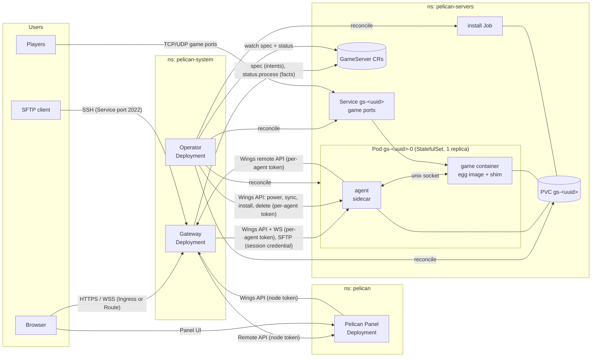
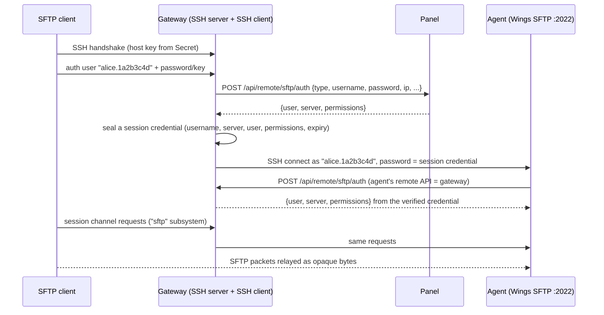
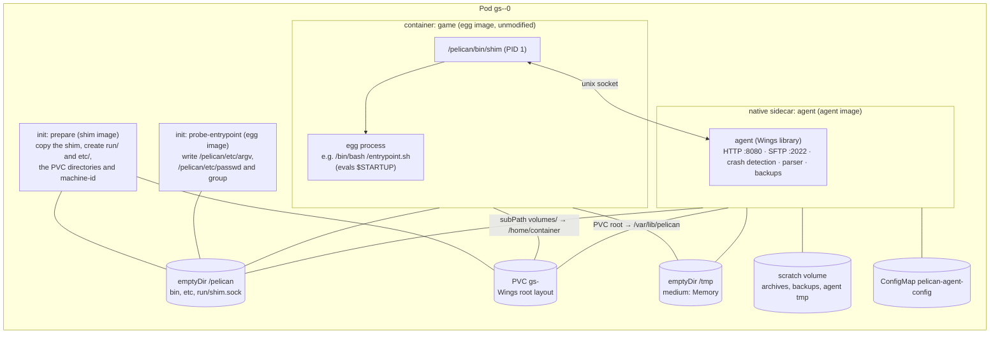
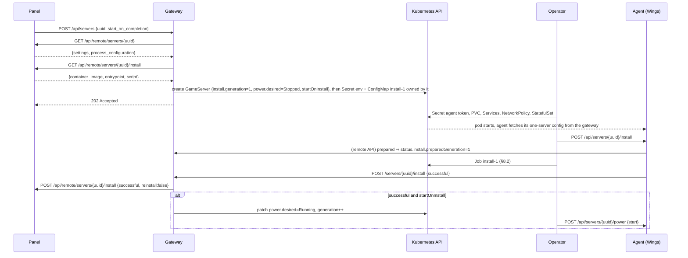
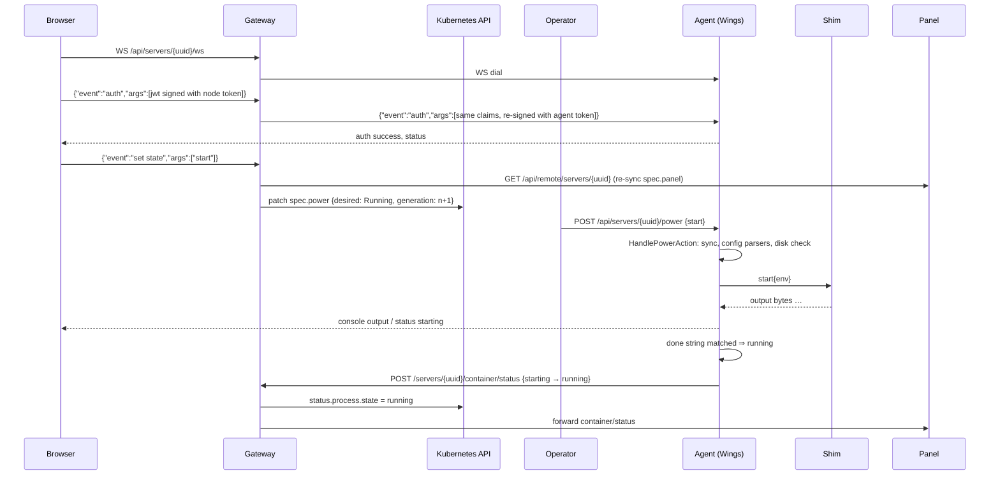

# pelican-k8s architecture

| | |
|---|---|
| **Kubernetes** | ≥ 1.33, single- or multi-node (1.35+ recommended for in-place pod resize) |
| **API group** | `pelican-k8s.io/v1alpha1` |
| **Upstream basis** | Pelican Wings `9fb682f`, Pelican Panel `6ba5264` (see [`docs/wings-panel-contract.md`](docs/wings-panel-contract.md)) |

---

## 1. Summary

Pelican Panel manages game servers through **Wings**, a per-host daemon that drives Docker.
pelican-k8s replaces Wings with Kubernetes-native components. **The Panel and the eggs are
unmodified.**

| Component | Kind | Role |
|---|---|---|
| **Gateway** | Deployment | Presents itself to the Panel as one Wings node and holds the node token. Turns Panel intents into `GameServer` spec changes, records observed process state in the status, and proxies data-path traffic (files, console, SFTP, backups) to the right agent |
| **Operator** | Deployment (controller) | The only reconciler. Turns one `GameServer` into a StatefulSet (1 replica), PVC, Services, NetworkPolicy, agent token Secret and install Jobs, and drives the agent (power, config sync, install, delete) until the process matches the spec |
| **Agent** | Native sidecar container in every game pod | Wings as a Go library with one server. Runs Wings' router, websocket, SFTP server, filesystem, config parsers, crash detection and backup code, and drives the game process through the shim |
| **Shim** | Static binary, the game container's entrypoint | Supervises the egg's process inside the unmodified egg image: PTY and stdin, signals, exit codes, cgroup stats |

**One game server = one pod + one PVC + one `GameServer`.** Wings' server logic runs next to the
data (agent). The Panel protocol is terminated centrally (gateway). Kubernetes owns scheduling,
storage, networking and restarts (operator).

---

## 2. Scope

**Provided:**

1. **Unmodified Panel.** The Panel sees an ordinary node (`scheme://fqdn:port`, SFTP port, token).
2. **Kubernetes-native workloads.**
   - Every server is a `GameServer` you can inspect with `kubectl`. Cluster policy
     (`GameServerClass`) is admin-owned; server specs are owned by the Panel through the gateway.
   - Pods are owned by controllers.
   - One PVC per server, so storage moves with the pod.
3. **The Wings feature set used day to day:** power control, console and stats; file manager,
   uploads and downloads, SFTP; egg installs and reinstalls, egg config-file rewriting, startup
   "done" detection; crash detection and auto-restart; backups (local and S3) and restore; activity
   log, suspension. [`docs/compatibility.md`](docs/compatibility.md) has the feature table.
4. **Restricted game pods.** Game pods run as a pinned non-root UID with no host access, all
   capabilities dropped and the `RuntimeDefault` seccomp profile. Install Jobs run as root in the same
   namespace, so the namespace is labelled `baseline` and the game pod shape is enforced by
   `ValidatingAdmissionPolicy`s that match pods in the servers namespace by ServiceAccount (§12.2).
5. **Wings as a dependency.** The agent imports Wings as a Go module; four opt-in hooks on a fork
   branch plug in the shim and the Job installer (§6.3).

**Not provided:** server transfers (one gateway is one node), Panel mounts, `force_outgoing_ip`,
swap, `io_weight`, CPU pinning (`threads`), disabling the OOM killer, and changes to the Panel.

---

## 3. Wings in brief

Details and source references: [`docs/wings-panel-contract.md`](docs/wings-panel-contract.md).

- **One daemon per host** that creates **one Docker container per server**:
  - host port = container port on both TCP and UDP
  - the server directory `/var/lib/pelican/volumes/<uuid>` is bind-mounted at `/home/container`
  - UID 988, read-only root filesystem, `/tmp` as tmpfs
- **Everything else Wings does reads the host disk directly:** SFTP server, file manager API, disk quotas,
  tar.gz backups, install scripts (run as root in a separate container) and egg config-file rewriting.
- **Console:** Docker attach (stdin/stdout), relayed to the browser over a JWT-authenticated websocket.
- **JWTs are HS256 signed with the node token.** Revocation and one-time-token state live in memory.
- **Scheduling is Panel-side** (Laravel queue plus cron).

---

## 4. Architecture overview


```mermaid
flowchart LR
  subgraph Users
    B[Browser]
    S[SFTP client]
    P[Players]
  end

  subgraph ns-panel["ns: pelican"]
    PANEL[Pelican Panel<br/>Deployment]
  end

  subgraph ns-system["ns: pelican-system"]
    GW[Gateway<br/>Deployment]
    OP[Operator<br/>Deployment]
  end

  subgraph ns-servers["ns: pelican-servers"]
    CR[(GameServer CRs)]
    subgraph POD["Pod gs-&lt;uuid&gt;-0 (StatefulSet, 1 replica)"]
      AG[agent<br/>sidecar]
      GM[game container<br/>egg image + shim]
    end
    PVC[(PVC gs-&lt;uuid&gt;)]
    SVC[Service gs-&lt;uuid&gt;<br/>game ports]
    JOB[install Job]
  end

  B -- "HTTPS / WSS (Ingress or Route)" --> GW
  S -- "SSH (Service port 2022)" --> GW
  PANEL -- "Wings API (node token)" --> GW
  GW -- "Remote API (node token)" --> PANEL
  B -- "Panel UI" --> PANEL

  GW -- "Wings API + WS (per-agent token), SFTP (session credential)" --> AG
  AG -- "Wings remote API (per-agent token)" --> GW
  OP -- "Wings API: power, sync, install, delete (per-agent token)" --> AG
  GW -- "spec (intents), status.process (facts)" --> CR
  OP -- "watch spec + status" --> CR
  OP -- "reconcile" --> POD & PVC & SVC & JOB

  AG <-- "unix socket" --> GM
  AG --- PVC
  GM --- PVC
  JOB --- PVC
  P -- "TCP/UDP game ports" --> SVC --> GM
```

### 4.1 Namespaces

| Namespace | Contents |
|---|---|
| `pelican` | Panel (web, queue worker and scheduler in one container), database, optional Redis |
| `pelican-system` | Gateway, operator, the node token Secret and the SFTP host key Secret |
| `pelican-servers` | `GameServer` CRs and everything they own, including two Secrets per server (egg variables, agent token) |

All servers live in the one servers namespace.

### 4.2 Design principles

1. **The node token never leaves the gateway.** It signs every browser JWT for every server, so any
   process holding it can impersonate the node. Game pods run arbitrary egg code and never see it.
2. **Terminate user traffic centrally, execute locally.** The gateway authenticates Panel and browser
   traffic and routes it. File I/O, process control, parsing, per-server token checks, revocation and
   rate limiting happen in the agent, next to the PVC, with Wings' own code.
3. **Intents go into the spec, facts go into the status, one controller closes the loop.**
   - The gateway is the only writer of `spec`: Panel settings become `spec.panel`, power actions become
     `spec.power`, installs become `spec.install`. It also records what agents report in
     `status.process`.
   - The operator is the only reconciler. It compares spec with status and acts, on Kubernetes objects
     and on the agent's Wings API alike. Nothing else issues power, sync or install calls.
   - `spec.power.desired` takes the place of Wings' `states.json`: `Running` on `start`/`restart`,
     `Stopped` when the process reaches `offline` through `stopping` (power `stop`/`kill`, the stop
     command typed into the console, suspension, a start that fails before the process runs). A crash leaves it at `Running`, so Wings' crash handler
     and pod recreation both restore a running server, and a server stopped from the console stays
     stopped after a node reboot.
4. **Wings' code, Kubernetes' plumbing.** The agent is a small `main` that imports Wings as a module,
   registers a shim-backed environment and a Job-backed installer through the hooks, and otherwise
   runs Wings' router, websocket and SFTP server.
5. **Container port = external port = Panel allocation port** in every exposure mode, so `SERVER_PORT`
   and what players connect to always agree.

---

## 5. Gateway

A Go service in `pelican-system` (`cmd/gateway`, `internal/gateway`). It uses Wings' `remote` and
`system` packages for the API types, verifies and re-signs JWTs itself (`jwtx`), and offers the same
SSH algorithms as Wings' SFTP server. It listens on `:8080` (Panel and browsers), `:8081` (remote API
for agents) and `:2022` (SFTP).

### 5.1 Responsibilities

1. Implement the **node-facing Wings HTTP API** toward the Panel (node-token auth, `User-Agent` response header).
2. Terminate **browser traffic** (websockets, signed download and upload URLs), verify it against the
   node token, and hand it to the right agent under that agent's own token (§5.4). Terminate **SFTP**,
   authenticate it against the Panel, and relay it to the agent with a per-session credential (§5.6).
3. Translate **server lifecycle** calls (create, sync, install, power, delete) into `GameServer` **spec**
   changes. The gateway never calls an agent to change state; that is the operator's job (§7.6).
4. Serve the **Wings remote API** to agents: each agent sees a Panel with exactly one server, and the
   gateway forwards only what belongs to that server (§5.7).
5. Record **observed process state** in `status.process` from the agents' `container/status` posts,
   and serve the Panel's latency-sensitive reads (`GET /api/servers/:s` has a 1 s timeout) from a short
   per-replica cache (§5.8).
6. Answer **node-level** endpoints (`/api/system*`, list servers) from cluster data and configuration.
7. Keep CRs in line with the Panel (resync, §13) and send the Panel's once-per-boot server reset (§8.9).

Wings' token denylist, one-time token store and boot cutoff run inside each agent for its own server.
The gateway's per-replica state is the live websocket and SSH connections and the state cache (§14).

### 5.2 Route handling

Server-scoped routes are proxied **by prefix**: anything under `/api/servers/:s/` that the gateway does
not intercept is forwarded to the agent unchanged. Every `/api/servers/:s*` route answers `404` when no
`GameServer` exists for `:s`.

| Route(s) | Handling at gateway |
|---|---|
| `POST /api/update` | `200 {"applied": false}` (configuration comes from Helm) |
| `GET /api/system` | Legacy form: the advertised Wings version, `os: linux`, kernel and architecture of the gateway pod. `?v=2`: Docker fields filled with placeholders (`kubernetes`, cgroups v2, storage `csi`/`pvc`), the gateway version as `runc`, and container counts from the CRs' status |
| `GET /api/diagnostics` | Plain-text report: gateway version, Panel URL and reachability, node token id, namespace, CR count, and per server its phase, process state, desired power state and whether the agent container has started |
| `GET /api/system/docker/disk` | Zero values |
| `DELETE /api/system/docker/image/prune` | `{"ImagesDeleted": null, "SpaceReclaimed": 0}` |
| `GET /api/system/ips` | The first non-empty source: `gateway.externalIPs`, the default class's `exposure.externalIPs`, MetalLB `IPAddressPool` addresses (`gateway.metallb.discoverPools`; at most `maxAddresses`, cached for a minute), the nodes' external and internal addresses |
| `GET /api/system/utilization` | Totals are the summed node allocatable memory and ephemeral storage; usage is the sum of the servers' `status.usage` |
| `GET /api/servers` | List from CRs plus the state cache |
| `POST /api/servers` | Server create flow (§8.1); spec only. For an existing CR: sync plus a new install generation (not a reinstall) |
| `POST /api/deauthorize-user` | Forward `{user, servers: [uuid]}` to the agent of each listed server, or of every server when `servers` is empty. Wings in each agent denylists the user and closes that user's websocket and SFTP sessions |
| `POST /api/transfers`, `DELETE /api/transfers/:s`, `POST`/`DELETE /api/servers/:s/transfer` | `501` |
| `GET /api/servers/:s` | From the state cache (§5.8). If the agent is unreachable, the last known state is served while the pod exists; `missing` if it does not |
| `DELETE /api/servers/:s` | Delete the CR (§8.8) |
| `POST /api/servers/:s/sync` | Re-fetch the Panel configuration, update `spec.panel` and the env Secret; `204` (§8.6) |
| `POST /api/servers/:s/install`, `/reinstall` | Re-sync the configuration, fetch the install payload, create the script ConfigMap, bump `spec.install.generation` (§8.2). `/reinstall` answers `409` within 3 s of the last power action |
| `POST /api/servers/:s/power` | Re-sync the configuration on `start`/`restart`, then patch `spec.power` (§8.3); `202`. `400` for starting a suspended server, `422` for an unknown action |
| `POST /api/servers/:s/commands`, `/ws/deny`, `GET /logs`, `/install-logs`, `/files/*`, `/backup*`, anything else under `/api/servers/:s/` | Proxy to the agent with the agent token |
| `GET /api/servers/:s/ws` | Websocket proxy (§5.5) |
| `GET /download/file`, `/download/backup`, `POST /upload/file` | Verify the JWT with the node token (`403` for a bad signature or an expired token, `404` for a wrong scope or a missing `server_uuid`), re-sign it with the agent token of the `server_uuid` claim (§5.4) and proxy to that agent, which runs Wings' scope, expiry, one-time and denylist checks |
| `GET /healthz` | Liveness and readiness of the gateway |

**Response headers:** every response carries `User-Agent: Pelican Wings/v<advertisedVersion> (id:<token_id>)`.
The advertised version is `gateway.advertisedVersion` (default `1.0.0`).

### 5.3 Routing to agents

- The gateway reads the server's pod `gs-<uuid>-0` from its informer cache. The agent is available
  when its native-sidecar container `agent` reports `started` and the pod has an IP and is not
  terminating. The gateway then dials `podIP:8080` (HTTP, websocket) and `podIP:2022` (SFTP).
- When the agent is not available, HTTP calls get `503 {"error": "server pod unavailable"}`, a
  websocket gets a `daemon error` frame and close code 1013, and an SFTP session is closed after
  authentication.
- The headless Service `gs-<uuid>-agent` is the StatefulSet's `serviceName`; the gateway does not
  route through it.
- Proxied requests have `X-Forwarded-For` removed, so the agent logs the gateway's address.

### 5.4 Per-agent tokens and JWT re-signing

Every agent is a complete Wings instance with its **own** `token_id.token`, generated by the operator into
Secret `gs-<uuid>-agent` (§7.4). The gateway and operator read it; the agent container gets it as
environment variables. The node token never leaves the gateway.

| Direction | Mechanism |
|---|---|
| Gateway/operator → agent HTTP API | `Authorization: Bearer <agent token>`, as the Panel talks to Wings. Wings' `RequireAuthorization` middleware checks it |
| Agent → gateway (remote API) | `Authorization: Bearer <token_id>.<token>` from the agent's own Wings `remote` client. The gateway maps the token to the server (§5.7); unknown tokens get `403` |
| Browser JWTs (websocket `auth`, signed URLs) | Signed by the Panel with the node token. The gateway **verifies** the HS256 signature and expiry with the node token, then **re-signs the same claims** (`iat`, `exp`, `jti`, `unique_id`, `server_uuid`, `user_uuid`, `permissions`, scope) with the agent token of the target server. Wings in the agent then validates the token as if it came from the Panel: scope, `exp`, one-time `unique_id`, `(server, user)` denylist and boot cutoff |

Because claims are preserved, revocation follows Wings: a `deauthorize-user` rejects tokens issued
before it, and an agent restart rejects tokens issued before the restart (the Panel UI fetches a fresh
one on `token expired`). A compromised agent can mint tokens for its own server only.

### 5.5 Websocket proxy

The gateway relays frames and reads the `{event, args}` format for `auth` and `set state`:

1. **Upgrade checks:** `Origin` is empty, the Panel URL, or one of `gateway.allowedOrigins` (`*`
   allows any). A suspended server is closed with code 4409 before dialing. Everything else
   (connections per server, inbound limiters, per-message token revalidation, permissions) is Wings
   code in the agent.
2. **Dial** the agent's `/api/servers/<uuid>/ws`.
3. **`auth` frames:** verify the JWT with the node token; a bad signature, an expired token or a
   `server_uuid` other than the path gets `jwt error` and is not forwarded. Valid tokens are re-signed
   with the agent token (§5.4) and forwarded.
4. **`set state` frames** are handled by the gateway, never forwarded: it checks the session's last
   `auth` claims (expiry; `control.start`, `control.stop`, `control.restart`, with `kill` mapped to
   `control.stop`) and refuses `start`/`restart` of a suspended server with a `daemon error` frame,
   then patches `spec.power` (§8.3). A missing permission drops the frame.
5. **Other text frames in both directions** pass through unchanged. Client binary frames are dropped;
   client frames are limited to 4 KiB. When Wings closes a session (suspension, deauthorize), the
   gateway relays the close code.

### 5.6 SFTP relay


```mermaid
sequenceDiagram
  participant C as SFTP client
  participant G as Gateway (SSH server + SSH client)
  participant P as Panel
  participant A as Agent (Wings SFTP :2022)
  C->>G: SSH handshake (host key from Secret)
  C->>G: auth user "alice.1a2b3c4d" + password/key
  G->>P: POST /api/remote/sftp/auth {type, username, password, ip, ...}
  P-->>G: {user, server, permissions}
  G->>G: seal a session credential (username, server, user, permissions, expiry)
  G->>A: SSH connect as "alice.1a2b3c4d", password = session credential
  A->>G: POST /api/remote/sftp/auth (agent's remote API = gateway)
  G-->>A: {user, server, permissions} from the verified credential
  C->>G: session channel requests ("sftp" subsystem)
  G->>A: same requests
  C-->>A: SFTP packets relayed as opaque bytes
```

- SSH has no SNI, so the target server is known only after authentication. The gateway terminates the
  client's SSH session, authenticates against the Panel with the client's real address, then acts as an
  SSH client toward the agent's **Wings SFTP server**. Permission checks, denylist file rules, disk quota
  and SFTP activity logging are Wings code.
- Usernames must have the form `<name>.<8-character server id>`, and the server must have a
  `GameServer`. The session credential carries the SSH username, the Panel's answer (server, user,
  permissions), a random nonce and an expiry 2 minutes ahead, sealed with HMAC-SHA256 under a key
  derived from the node token. Any gateway replica verifies it without shared state, so the agent's
  `/sftp/auth` call may reach any replica; the agent cannot forge or alter one, and the gateway
  answers only credentials for the calling agent's own server.
- The agent's host key is pinned on first connection (SHA256 fingerprint in
  `status.agent.sftpHostKey`). The gateway's own host key is an ED25519 key in Secret
  `pelican-gateway-sftp-hostkey` (key `id_ed25519`), generated on first start.
- `gateway.sftp.keyOnly` disables password logins at the gateway; `agent.sftpReadOnly` is Wings'
  `read_only`. SFTP activity rows carry the gateway's address as the client IP.

### 5.7 Wings remote API served to agents

The agent's Wings `remote` client points at the gateway's `:8081` listener. The gateway authenticates
the `token_id.token`, maps it to a server, and answers as a Panel that owns exactly that server:

| Agent call | Gateway behaviour |
|---|---|
| `GET /servers?page=` | One-item list: `{settings, process_configuration}` assembled from `spec.panel` and the `gs-<uuid>-env` Secret (§9.4); `build.memory_limit: 0` becomes the class `unlimitedMemoryMiB` and the default allocation IP becomes `0.0.0.0` |
| `GET /servers/{uuid}` | Same object; `404` for any other UUID |
| `POST /servers/reset` | `204`, dropped (the gateway sends the node reset itself, §8.9) |
| `POST /servers/{uuid}/container/status` | Write `status.process.state`; set `spec.power.desired=Stopped` (and `kill: false`) when `previous_state` is `stopping` and `new_state` is `offline`, unless the pod is terminating; refresh `status.usage`; forward to the Panel |
| `GET /servers/{uuid}/install` | Install script of `spec.install.generation` from ConfigMap `gs-<uuid>-install-<gen>`, with `spec.install.image` and `entrypoint`; `404` if the ConfigMap is missing |
| `POST /servers/{uuid}/install/prepared` | Record `status.install.preparedGeneration` and `result: Running`; answer with the generation and `strict_exit_code` (§8.2) |
| `GET /servers/{uuid}/install/state?generation=` | The Job outcome recorded by the operator, polled by the installer |
| `POST /servers/{uuid}/install` | Record `status.install.result`, `finishedAt` and `reportedGeneration`; forward to the Panel; on success with `spec.install.startOnInstall`, start the server |
| `POST /activity` | Forward rows whose `server` is the caller; drop the rest. A `422` from the Panel drops the batch |
| `GET /backups/{b}?size=`, `POST /backups/{b}`, `POST /backups/{b}/restore` | Forward when `b` is in `status.backups.pending` for the caller (learned from the proxied backup and restore calls); a result post removes the entry; unknown backups get `404` |
| `POST /sftp/auth` | Verify the SFTP session credential (§5.6) and answer with the Panel response sealed in it when it is for the caller's server; never forwarded |
| transfers, anything else | `404`, logged as a warning |

`test/upstream` diffs Wings' remote client calls against the list the gateway serves (§17).

### 5.8 State cache

`GET /api/servers/:s` and the list endpoint are served from a per-replica cache filled by polling the
agent's `GET /api/servers/:s` (state plus utilization) on demand: 2 s TTL, 900 ms poll timeout. A
`container/status` post or a server delete invalidates the entry. State changes go to `status.process`
when the agent posts them; after each post the gateway also refreshes `status.usage` from a fresh poll.

---

## 6. Agent and shim

### 6.1 Pod layout


```mermaid
flowchart TB
  subgraph Pod["Pod gs-<uuid>-0"]
    direction TB
    I1["init: prepare (shim image)<br/>copy the shim, create run/ and etc/,<br/>the PVC directories and machine-id"]
    I2["init: probe-entrypoint (egg image)<br/>write /pelican/etc/argv,<br/>/pelican/etc/passwd and group"]
    subgraph A["native sidecar: agent (agent image)"]
      W["agent (Wings library)<br/>HTTP :8080 · SFTP :2022 · crash detection · parser · backups"]
    end
    subgraph G["container: game (egg image, unmodified)"]
      SH["/pelican/bin/shim (PID 1)"] --> EP["egg process<br/>e.g. /bin/bash /entrypoint.sh<br/>(evals $STARTUP)"]
    end
    V1[("emptyDir /pelican<br/>bin, etc, run/shim.sock")]
    V2[("PVC gs-<uuid><br/>Wings root layout")]
    V3[("emptyDir /tmp<br/>medium: Memory")]
    V4[("scratch volume<br/>archives, backups, agent tmp")]
    V5[("ConfigMap pelican-agent-config")]
  end
  SH <-- "unix socket" --> W
  G --- V1 & V3
  A --- V1 & V3 & V4 & V5
  I1 --- V1 & V2
  I2 --- V1
  G -- "subPath volumes/<uuid> → /home/container" --- V2
  A -- "PVC root → /var/lib/pelican" --- V2
```

The game container mounts `/pelican/bin`, `/pelican/etc` and `/pelican/run` read-only; the agent
mounts only `/pelican/run`, read-write, and listens on the shim socket there. Both containers mount the
same `/tmp`.

### 6.2 PVC layout

The PVC root is a Wings `root_directory` for one server, so Wings path logic applies unchanged:

```
/ (PVC root, mounted in the agent at /var/lib/pelican)
├── volumes/<uuid>/          # server files → game container /home/container (subPath)
├── logs/install/<uuid>.log  # install log in Wings' format (GET /install-logs)
├── logs/console/<uuid>.log  # console output of the current run (Readlog source)
├── install/<generation>/    # install Job output: output.log, exit-code
├── wings.db                 # activity SQLite (unsent rows survive restarts)
└── machine-id               # the server UUID without dashes (subPath → /etc/machine-id)
```

The game container mounts **only** `volumes/<uuid>` and `machine-id`, so a game process cannot read
activity, logs or install state. The `prepare` init container runs as the pod UID and creates `volumes/<uuid>`,
`install/`, `logs/install/` and `machine-id` before any container mounts them as `subPath`; the agent
creates `logs/console/` and Wings creates `wings.db`. Backup archives and Wings'
temporary files live on the pod's scratch volume (§10.1).

### 6.3 Agent = Wings as a library

`cmd/agent` calls `internal/agent/app`, which imports `github.com/pelican/wings` and runs the parts of
Wings' boot sequence that do not touch Docker: `config.FromFile`, the `remote` client (base URL = gateway,
§5.7), the activity database, `server.NewManager` (which fetches the one-server list from the gateway),
the cron scheduler, `sftp.New` and `router.Configure`. A `ServeMux` in front of Wings' Gin engine adds
the agent's own routes and serves both on `:8080`:

| Agent route | Caller | Purpose |
|---|---|---|
| `GET /internal/v1/healthz` | kubelet | Startup and liveness probe of the agent container |
| `GET /internal/v1/ready` | kubelet | Readiness probe of the game container: `200` only in Wings' `running` state |
| `/internal/v1/prestop` | kubelet `preStop` (httpGet) of the game and the agent container | Run Wings' stop procedure for the process and return when it is offline (§6.4) |
| `POST /internal/v1/exit-state {code, oomKilled}` | operator (agent token) | Inject the exit of a game container that terminated, e.g. after an OOM kill (§6.4) |

Everything else the agent serves is Wings' router: power, commands, files, backups, websocket, signed
downloads and uploads, `deauthorize-user`, `ws/deny`, and the SFTP server on `:2022`.

**Hooks.** The agent plugs into Wings through four opt-in hooks on the `pelican-k8s-hooks` branch of
[Claiyc/wings](https://github.com/Claiyc/wings), which `go.mod` pins with a `replace`:

| # | Hook | Used by the agent for |
|---|---|---|
| 1 | `server.EnvironmentFactory` (`func(*Server, *environment.Configuration) (environment.ProcessEnvironment, error)`), set with `server.WithEnvironmentFactory`; default `server.DockerEnvironmentFactory` | `internal/agent/shimenv`, a `ProcessEnvironment` over the shim socket |
| 2 | `server.ImageAndStopConfigurable` and `server.Attachable` interfaces in place of `*docker.Environment` type assertions | Image and stop configuration, websocket attach |
| 3 | `server.Installer` interface, set with `server.WithInstaller`; Wings takes the install lock before calling it | `internal/agent/installer`, the Job-backed installer (§8.2) |
| 4 | Package `boot` (`boot.InitializeDatabase`, `boot.Scheduler`) over Wings' `internal/database` and `internal/cron` | Activity database and cron scheduler |

**Configuration.** ConfigMap `pelican-agent-config` (`config.yml`, rendered from the chart's `agent.*`
values, `agent.extra` merged in) plus the token Secret:
`token_id`/`token` from `WINGS_TOKEN_ID`/`WINGS_TOKEN`, `remote: http://<release>-gateway.<namespace>.svc:8081`
(`gateway.remoteURL`), `api.host: 0.0.0.0`, `api.port: 8080`, `system.root_directory: /var/lib/pelican`,
`system.data: /var/lib/pelican/volumes`, `system.log_directory: /var/lib/pelican/logs`,
`system.archive_directory: /scratch/archives`, `system.backup_directory: /scratch/backups`,
`system.tmp_directory: /scratch/tmp`, `system.sftp.bind_port: 2022`, `system.user.rootless.enabled: true`,
`system.user.passwd.enable: false`, `system.machine_id.enable: false`,
`system.check_permissions_on_boot: false`, `system.enable_log_rotate: false`,
`docker.network.interface: 0.0.0.0` (§9.4), `ignore_panel_config_updates: true`,
`allowed_origins: ["*"]`, plus crash detection, SFTP read-only, upload limit, timezone and websocket log
count from the chart values. At start the agent sets Wings' user and rootless container UID/GID to its
own UID. The agent never starts a server at boot; the operator does that from `spec.power` (§7.6).

**Wings code that runs unchanged:**
- `server/filesystem` (safe path resolution, denylist, disk usage, soft quota)
- the file routes, compress and decompress, remote file pull (with Wings' private-range block)
- the router, token validation, one-time store, denylist and cutoff
- the websocket handler and listeners, done detection, egg config parsers, crash detection
- the SFTP server and handler
- backup adapters (local, S3 multipart via the Panel) and restore
- activity database and crons

### 6.4 Shim

A static Go binary (`cmd/shim`, `internal/shim`). The `prepare` init container copies it into the
`/pelican` emptyDir, and it is the game container's `command`. It is PID 1 of the game container and
stays up while the game process is stopped, so a stopped server keeps its pod (files, SFTP, websocket,
stats). The game container's readiness probe asks the agent (`GET /internal/v1/ready`), so pod
readiness shows whether the game runs. The container has no liveness or startup probe, and nothing
consumes pod readiness (both Services publish not-ready addresses, the StatefulSet is `OnDelete` +
`Parallel`).

**Socket and authentication.** The agent listens on `/pelican/run/shim.sock` (mode 0600; both
containers run as the same UID) and the shim connects to it, reconnecting after an agent restart. The
game container mounts `/pelican/run` read-only, so the game process can connect to the socket but cannot
remove, rename or replace it. Every connection starts with a challenge from the agent; the shim answers
with HMAC-SHA256 over the challenge keyed with the shim token (`PELICAN_SHIM_TOKEN` from Secret
`gs-<uuid>-shim`, in the env of both containers). The agent hands only authenticated connections to
Wings, and a newer one replaces the previous one. The shim makes itself non-dumpable
(`PR_SET_DUMPABLE=0`) before it reads the token, so a process with the same UID and no capabilities
cannot read its memory, `/proc/1/environ` or `/proc/1/fd`, and it removes the token from the
environment it gives the game process. Events reach a connection only after the agent subscribes.

**Protocol** (JSON lines over the authenticated connection):

- `start{env}`: spawn the argv in a PTY, process group of its own, `cwd=/home/container`, the
  environment from the agent merged over the container's. The argv is the container's `args` when the
  operator resolved one (class `entrypointOverrides` or registry lookup, §7.5), otherwise
  `/pelican/etc/argv` written by `probe-entrypoint` (`/bin/bash /entrypoint.sh`, or `/bin/sh` when the
  image has no bash). `/tmp` is emptied and the ring buffer reset before each start.
- `stdin{bytes}`, `signal{name}` (to the process group), `kill`, `status`, `subscribe{replay}`.
- Events: `output` (PTY bytes, also teed to the container's stdout so `kubectl logs -c game` shows the
  console; the shim's own JSON logs go to stderr), `started`, `stats`, `exited{code, oomKilled}`.

**Behaviour:**
- **Process exit:** the shim reports `exited`, SIGKILLs the rest of the process group and, as PID 1,
  every other process left in the container's PID namespace (e.g. a `wineserver` that left the group),
  and reaps orphans. The shim keeps running.
- **OOM:** each run compares the cgroup's `memory.events` `oom_kill` counter before and after and sets
  `oomKilled`. On cgroup v2 kubelet sets `memory.oom.group=1`, so an OOM normally kills the whole
  container, shim included, and kubelet restarts it. The operator relays every game container
  termination it sees (`lastState.terminated`: exit code, `OOMKilled`) to the agent's
  `/internal/v1/exit-state`, and the agent runs Wings' crash handling on it. When the agent reconnects
  to a restarted shim that is idle while Wings expected the process to run, it records the shim's last
  exit (or exit code 137) and goes `offline`, so crash handling also runs without the relay.
- **SIGTERM** (pod deletion, eviction, drain): kubelet runs the game container's `preStop` hook first,
  which calls the agent's `/internal/v1/prestop`; the agent runs Wings' stop procedure (stop command or
  signal, `WaitForStop`, then terminate) and returns once the process is offline. The shim then
  receives SIGTERM: it stops reconnecting, reports that it is stopping, sends SIGTERM to the process
  group, and SIGKILL after 10 s. The agent is a native sidecar, so it is terminated after the game
  container has exited.
- **Stats** every 2 s while a process runs: memory (`memory.current` minus `inactive_file`; the limit
  from `memory.max`, or `MemTotal` when unlimited), CPU from `cpu.stat`, I/O from `io.stat`, network
  from `/proc/net/dev` without `lo`.

**`ProcessEnvironment` mapping** (`internal/agent/shimenv`):

| Method | Behaviour |
|---|---|
| `Attach` | Wait for the shim's authenticated connection and subscribe; `exited` ⇒ `SetState(offline)` (drives Wings' crash detection) |
| `Start` | Wait for the shim connection, truncate the console log, `starting`, `start{env}`. If the shim already runs the process, mark it running and attach |
| `Stop` | Stop type `signal` ⇒ `signal{}` (Wings' mapping, unknown ⇒ SIGKILL); type `command` ⇒ `stdin{value+"\n"}` |
| `WaitForStop` / `Terminate` | Poll the shim status; SIGKILL on timeout |
| `SendCommand` | `stdin{}` (sets `stopping` first if it equals the stop command, as Wings does) |
| `Readlog(n)` | Tail of `logs/console/<uuid>.log` |
| `ExitState` | From `exited{}`, the operator's `/internal/v1/exit-state`, or the reconnect case above; code 1 when no exit is known |
| `IsRunning`, `Uptime` | Shim status |
| `InSituUpdate` | No-op; the operator resizes the pod in place |
| `Create`, `Exists` | No-op and always true; the pod belongs to the operator |
| `Destroy` | `stopping`, SIGKILL to the process group through the shim (`kill`), then `offline` |

**Agent restart:** the agent container restarts while the game keeps running. The shim reconnects to
the new agent's socket, and the agent finds the process running and re-attaches; the console history
comes from the console log, or from the shim's ring buffer when the log is empty.

---

## 7. `GameServer` custom resource and operator

### 7.1 Spec

```yaml
apiVersion: pelican-k8s.io/v1alpha1
kind: GameServer
metadata:
  name: gs-1a2b3c4d-5e6f-4a7b-8c9d-0e1f2a3b4c5d   # "gs-" + server uuid
  namespace: pelican-servers
  labels:
    pelican-k8s.io/server-uuid: 1a2b3c4d-5e6f-4a7b-8c9d-0e1f2a3b4c5d
    pelican-k8s.io/egg-uuid: 9f8e...
  annotations:
    pelican-k8s.io/panel-name: "Survival SMP"
spec:
  # --- mirrored from the Panel (written by the gateway, never edited by hand) ---
  panel:
    uuid: 1a2b3c4d-5e6f-4a7b-8c9d-0e1f2a3b4c5d
    uuidShort: 1a2b3c4d
    # The raw `settings` object from GET /api/remote/servers/{uuid}, minus `environment`
    # (preserve-unknown-fields). The agent consumes it as its Wings server configuration;
    # the operator reads uuid, meta.name, egg.id, suspended, container.image, build.* and allocations.*.
    settings:
      id: 1
      meta: {name: "Survival SMP", description: ""}
      suspended: false
      invocation: "java -Xms128M -Xmx{{SERVER_MEMORY}}M -jar {{SERVER_JARFILE}}"
      skip_egg_scripts: false
      build: {memory_limit: 4096, swap: 0, io_weight: 500, cpu_limit: 200, threads: null, disk_space: 10240, oom_killer: true}
      container: {image: ghcr.io/pelican-eggs/yolks:java_21, requires_rebuild: false}
      allocations:
        force_outgoing_ip: false
        default: {ip: "203.0.113.10", port: 25565}   # servers without allocation: {ip: 127.0.0.1, port: 0}, mappings {"": []}
        mappings: {"203.0.113.10": [25565, 25575]}
      egg:
        id: 9f8e...
        file_denylist: []
        features: {eula: ["You need to agree to the EULA"]}
      labels: {}
    # Egg variables (may contain credentials) live in a Secret, not in the CR.
    environmentSecretRef: {name: gs-1a2b3c4d-5e6f-4a7b-8c9d-0e1f2a3b4c5d-env}
    processConfiguration:   # the Panel's raw process_configuration (preserve-unknown-fields)
      startup: {done: [")! For help, type "], user_interaction: [], strip_ansi: false}
      stop: {type: command, value: stop}
      configs: [...]
    panelRevision: "sha256:…"   # hash of settings (without environment) + process_configuration

  # --- desired process state (§4.2; written by the gateway, kubectl-editable) ---
  power:
    desired: Running          # Running | Stopped (default Stopped)
    generation: 3             # bumped with every power action; the operator acts once per generation
    kill: false               # with desired=Stopped: SIGKILL instead of the stop procedure
    restartRequest: 0         # bump to recreate the pod at the next safe point

  # --- install requests (written by the gateway) ---
  install:
    generation: 1             # bump ⇒ the operator runs a new install once the agent has prepared (§8.2)
    reinstall: false
    scriptConfigMap: gs-1a2b3c4d-5e6f-4a7b-8c9d-0e1f2a3b4c5d-install-1
    image: ghcr.io/pelican-eggs/installers:debian
    entrypoint: bash
    startOnInstall: false     # start once this generation succeeds (Panel start_on_completion)

  # --- cluster-side policy (admin-editable) ---
  className: default          # default "default"
```

`settings.build.memory_limit` and `cpu_limit` may be `0` (unlimited in the Panel); the class supplies
the resources used in that case (§7.3, §11).

### 7.2 Status

```yaml
status:
  observedGeneration: 7
  phase: Running            # Pending | Installing | Stopped | Starting | Running | Stopping | Suspended | Error
  process:                  # state/since: gateway (agent's container/status posts); lastExit: operator (relayed container exit)
    state: running          # offline | starting | running | stopping
    since: "…"
    lastExit: {code: 0, oomKilled: false, at: "…"}
  power:                    # written by the operator
    observedGeneration: 3   # spec.power.generation last acted on
    observedRestartRequest: 0
    lastAction: {action: start, at: "…", podUID: "…"}
  agent:
    podUID: "…"             # pod whose agent the operator last drove; a new UID means "fresh pod"
    sftpHostKey: "SHA256:…" # pinned by the gateway on the first SFTP connection (§5.6)
    relayedExit: "…"        # last game container termination relayed to the agent
    syncedRevision: "sha256:…"   # spec.panel.panelRevision last synced into the agent
    syncedEnvVersion: "…"   # env Secret resourceVersion last synced into the agent
  usage:                    # refreshed by the gateway on every process state change
    memoryBytes: 2147483648
    cpuPercent: "37.5"
    diskBytes: 5368709120
    updatedAt: "…"
  install:
    requestedGeneration: 1  # generation the operator asked the agent to install
    requestedAt: "…"
    preparedGeneration: 1   # the agent holds the install lock for this generation
    jobName: gs-…-install-1
    result: Succeeded       # Running | Succeeded | Failed
    finishedAt: "…"
    reportedGeneration: 1   # result forwarded to the Panel
    observedGeneration: 1
  backups:
    pending: [ {uuid: "…", startedAt: "…"} ]
  endpoints:
    - {ip: "203.0.113.10", port: 25565, protocols: [TCP, UDP]}
  podImage: ghcr.io/pelican-eggs/yolks:java_21@sha256:…
  templateHash: "…"         # pod template hash of the current StatefulSet
  snapshot: {lastAt: "…", lastName: gs-…-20261006-120000}
  conditions:
    - type: VolumeReady          # PVC bound
    - type: ExposureReady        # Service has its address (reasons include HostPort, NoAllocation, Pending, PortOutOfRange, AllocationIPNotOnNode)
    - type: AgentReady           # agent container started and ready
    - type: InstallPrepared      # agent holds the install lock for spec.install.generation
    - type: Installed            # True once a generation finished; reason Succeeded or Failed
    - type: ResizePending        # in-place resize deferred, infeasible or needing a recreate
    - type: RecreatePending      # pod template change waiting for the process to be offline
    - type: NodeLost             # pod Terminating on a NotReady node (with failover.forceDeleteAfter, §14)
    - type: DiskShrinkRefused    # Panel disk_space below the PVC size
    - type: Orphaned             # set by the gateway when the Panel no longer lists the server (§13)
```

### 7.3 `GameServerClass` (cluster-side policy)

Admin-owned, cluster-scoped, referenced by `spec.className`. The chart creates `default` from
`defaultClass.spec`; [`docs/classes.md`](docs/classes.md) documents every field.

```yaml
apiVersion: pelican-k8s.io/v1alpha1
kind: GameServerClass
metadata: {name: default}
spec:
  storage:
    storageClassName: ""          # cluster default; must allow volume expansion
    defaultSizeGiB: 20            # used when disk_space = 0
    overheadPercent: 10           # PVC = disk_space × 1.10 (logs, wings.db, install output)
    scratch:                      # archives, backups and agent temp files (§10.1)
      type: Ephemeral             # Ephemeral (generic ephemeral volume) | EmptyDir
      storageClassName: ""
      sizeGiB: 0                  # 0 = size of the server PVC
    deletionPolicy: Delete        # Delete | Retain | SnapshotThenDelete
    volumeSnapshotClassName: ""   # "" = cluster default
    snapshotSchedule: ""          # cron; scheduled VolumeSnapshots (§10.4)
    snapshotRetain: 7
  exposure:
    mode: LoadBalancer            # LoadBalancer | NodePort | HostPort
    externalTrafficPolicy: Local
    loadBalancer:
      provider: ""                # "metallb" supplies the two keys below
      ipAnnotation: ""            # pins the Service to the allocation IP
      sharingAnnotation: ""       # lets several Services share one IP
      annotations: {}             # added verbatim to exposure Services
    externalIPs: []               # offered to the Panel by /api/system/ips
  network:
    enabled: true                 # per-server NetworkPolicy
    blockedEgressCIDRs: [10.0.0.0/8, 172.16.0.0/12, 192.168.0.0/16, 100.64.0.0/10]   # excluded from internet egress
    nodeCIDRs: []                 # node addresses admitted on the agent port (kubelet probes)
    inClusterEgress:
      gameServers: true           # game pods may reach other game pods (proxies such as Velocity)
      additional: []              # e.g. [{cidr: 10.43.0.0/16, ports: [9000]}] for an in-cluster S3
  resources:
    memoryOverheadPercent: 5      # memory limit = memory_limit × 1.05
    cpuRequestPercentOfLimit: 25
    memoryRequestPercentOfLimit: 100
    unlimitedMemoryMiB: 4096      # used when memory_limit = 0
    unlimitedCpuPercent: 0        # used when cpu_limit = 0; 0 = no limit
    minCpu: 100m
    tmpSizeMiB: 100
    agent: {cpu: 50m, memory: 128Mi, memoryLimit: 512Mi}
  security:
    runAsUser: 1000               # pinned UID and GID (also fsGroup)
    generatePasswdEntry: true
    useNamespaceUIDRange: false   # OpenShift: start of openshift.io/sa.scc.uid-range
  install:
    serviceAccountName: pelican-installer
    resources: {cpu: "1", memory: 1Gi}
    strictExitCode: false
    activeDeadlineSeconds: 3600
    prepareTimeoutSeconds: 600
    runAsRoot: true
    disableSeccomp: false
  failover:
    forceDeleteAfter: ""          # e.g. 5m (§14)
  imageResolution:
    registryLookup: false
    pullSecrets: []
    pinDigest: true
    entrypointOverrides:          # glob → argv
      "ghcr.io/pelican-eggs/yolks:*": ["/bin/bash", "/entrypoint.sh"]
      "ghcr.io/pelican-eggs/steamcmd:*": ["/bin/bash", "/entrypoint.sh"]
      "ghcr.io/pelican-eggs/games:*": ["/bin/bash", "/entrypoint.sh"]
  images: {shim: …, agent: …, pullPolicy: …}   # set by the chart
  serviceAccountName: pelican-game
  agentConfigMap: pelican-agent-config
  terminationGracePeriodSeconds: 660
  suspendScalesToZero: false
  nodeSelector: {}
  tolerations: []
  priorityClassName: ""
```

With `openshift.enabled` the chart sets `security.useNamespaceUIDRange` and `install.disableSeccomp`.

### 7.4 Owned resources

| Resource | Name | Notes |
|---|---|---|
| PersistentVolumeClaim | `gs-<uuid>` | RWO, size = `disk_space × (1 + overhead)`, expanded online on change. No ownerReference under `deletionPolicy: Retain` |
| Secret | `gs-<uuid>-env` | Egg variables plus the derived `STARTUP`, `SERVER_MEMORY`, `SERVER_IP`, `SERVER_PORT`, `SERVER_PUBLIC_IP`, `TZ`; created by the gateway, owned by the CR. Served to the agent as part of its Wings configuration (§5.7) and used via `envFrom` by install Jobs |
| Secret | `gs-<uuid>-agent` | The agent's own Wings `token_id` and `token` (§5.4); generated by the operator, owned by the CR, exposed to the agent container as `WINGS_TOKEN_ID`/`WINGS_TOKEN` |
| Secret | `gs-<uuid>-shim` | The shim token (`token`, §6.4); generated by the operator, owned by the CR, exposed to the agent and game containers as `PELICAN_SHIM_TOKEN` |
| StatefulSet | `gs-<uuid>` | `replicas: 1` (0 while suspended with `suspendScalesToZero`), `updateStrategy: OnDelete`, `podManagementPolicy: Parallel`, `serviceName: gs-<uuid>-agent`, explicit PVC volume (no `volumeClaimTemplates`), PVC retention `Retain`. At most one pod, so the RWO volume is never double-mounted |
| Service (exposure) | `gs-<uuid>` | One port entry per allocation port for each of TCP and UDP; type from the class (a type change recreates it); `publishNotReadyAddresses: true`. Not created in HostPort mode or for a server without an allocation. With `sharingAnnotation`, the value is `pelican-<allocation IP>` |
| Service (agent) | `gs-<uuid>-agent` | Headless, agent HTTP (8080) and SFTP (2022) ports, `publishNotReadyAddresses: true`; the StatefulSet's `serviceName` |
| NetworkPolicy | `gs-<uuid>` | The pod's ingress and egress rules (§12.4); not created with `network.enabled: false` |
| ConfigMap | `gs-<uuid>-install-<gen>` | Install script; created by the gateway, owned by the CR |
| Job | `gs-<uuid>-install-<gen>` | Install run (§8.2); label `pelican-k8s.io/install-generation` |
| VolumeSnapshot | `gs-<uuid>-<YYYYMMDD-HHMMSS>`, `gs-<uuid>-final` | Scheduled and final snapshots (§10.4); no ownerReference |

### 7.5 Pod template (abridged)

```yaml
metadata:
  annotations: {pelican-k8s.io/template-hash: …, pelican-k8s.io/panel-name: …}
spec:
  automountServiceAccountToken: false
  serviceAccountName: pelican-game            # pelican-game-hostport in HostPort mode
  enableServiceLinks: false
  restartPolicy: Always
  terminationGracePeriodSeconds: 660          # > Wings' 10-min stop wait; spent in the preStop hooks
  securityContext:
    runAsNonRoot: true
    runAsUser: <class runAsUser>               # or the namespace UID range start (§12.2)
    runAsGroup: <same>
    fsGroup: <same>
    fsGroupChangePolicy: OnRootMismatch
    seccompProfile: {type: RuntimeDefault}
  initContainers:
    - name: prepare
      image: <class images.shim>
      command: ["/shim", "prepare", "--bin", "/pelican/bin/shim", "--shared", "/pelican", "--data", "/data", "--uuid", "<uuid>"]
      volumeMounts: [{name: pelican, mountPath: /pelican}, {name: data, mountPath: /data}]
    - name: probe-entrypoint                     # egg image
      image: <pod image>
      command: ["/pelican/bin/shim", "probe", "--out", "/pelican/etc/argv", "--name", "container",
                "--home", "/home/container", "--uid", "<uid>", "--gid", "<uid>",
                "--passwd", "/pelican/etc/passwd", "--group", "/pelican/etc/group",   # with generatePasswdEntry
                "--", "<resolved argv>"]                                              # when resolved
      volumeMounts: [{name: pelican, mountPath: /pelican}]
    - name: agent                                # native sidecar: starts before and stops after the game container
      restartPolicy: Always
      image: <class images.agent>
      args: ["--config", "/etc/pelican/config.yml", "--shim-socket", "/pelican/run/shim.sock"]
      ports: [{name: agent, containerPort: 8080}, {name: sftp, containerPort: 2022}]
      startupProbe: {httpGet: {path: /internal/v1/healthz, port: agent}, periodSeconds: 2, failureThreshold: 60}
      livenessProbe: {httpGet: {path: /internal/v1/healthz, port: agent}, periodSeconds: 10}
      lifecycle: {preStop: {httpGet: {path: /internal/v1/prestop, port: agent}}}
      env:
        - {name: PELICAN_SERVER_UUID, value: <uuid>}
        - {name: PELICAN_POD_IMAGE, value: <pod image>}
        - {name: PELICAN_POD_IP, valueFrom: {fieldRef: {fieldPath: status.podIP}}}
        - {name: WINGS_TOKEN_ID, valueFrom: {secretKeyRef: {name: gs-<uuid>-agent, key: token_id}}}
        - {name: WINGS_TOKEN, valueFrom: {secretKeyRef: {name: gs-<uuid>-agent, key: token}}}
        - {name: PELICAN_SHIM_TOKEN, valueFrom: {secretKeyRef: {name: gs-<uuid>-shim, key: token}}}
      resources: {requests: {cpu: 50m, memory: 128Mi}, limits: {memory: 512Mi}}   # class resources.agent
      securityContext: {allowPrivilegeEscalation: false, readOnlyRootFilesystem: true, capabilities: {drop: [ALL]}}
      volumeMounts:
        - {name: data, mountPath: /var/lib/pelican}
        - {name: scratch, mountPath: /scratch}
        - {name: tmp, mountPath: /tmp}
        - {name: pelican, mountPath: /pelican/run, subPath: run}
        - {name: agent-config, mountPath: /etc/pelican, readOnly: true}
  containers:
    - name: game
      image: <pod image>                        # digest-pinned (below)
      command: ["/pelican/bin/shim", "run", "--socket", "/pelican/run/shim.sock", "--argv-file", "/pelican/etc/argv", "--dir", "/home/container", "--"]
      args: <resolved argv, or empty ⇒ the shim reads /pelican/etc/argv>
      ports: <allocation ports, TCP+UDP>        # + hostPort in HostPort mode
      resources: <§11>
      resizePolicy: [{resourceName: cpu, restartPolicy: NotRequired}, {resourceName: memory, restartPolicy: NotRequired}]
      readinessProbe: {httpGet: {path: /internal/v1/ready, port: 8080}, periodSeconds: 5, failureThreshold: 1}
      lifecycle: {preStop: {httpGet: {path: /internal/v1/prestop, port: 8080}}}
      securityContext: {allowPrivilegeEscalation: false, readOnlyRootFilesystem: true, capabilities: {drop: [ALL]}}
      env:
        - {name: HOME, value: /home/container}
        - {name: USER, value: container}
        - {name: PELICAN_SHIM_TOKEN, valueFrom: {secretKeyRef: {name: gs-<uuid>-shim, key: token}}}   # read by the shim, never passed to the game process
      volumeMounts:
        - {name: data, mountPath: /home/container, subPath: volumes/<uuid>}
        - {name: data, mountPath: /etc/machine-id, subPath: machine-id, readOnly: true}
        - {name: pelican, mountPath: /pelican/bin, subPath: bin, readOnly: true}
        - {name: pelican, mountPath: /pelican/etc, subPath: etc, readOnly: true}
        - {name: pelican, mountPath: /pelican/run, subPath: run, readOnly: true}
        - {name: pelican, mountPath: /etc/passwd, subPath: etc/passwd, readOnly: true}   # with generatePasswdEntry
        - {name: pelican, mountPath: /etc/group, subPath: etc/group, readOnly: true}     # with generatePasswdEntry
        - {name: tmp, mountPath: /tmp}
  volumes:
    - {name: data, persistentVolumeClaim: {claimName: gs-<uuid>}}
    - {name: pelican, emptyDir: {}}
    - {name: tmp, emptyDir: {medium: Memory, sizeLimit: <tmpSizeMiB>Mi}}
    - {name: scratch, ephemeral: {volumeClaimTemplate: …}}   # or emptyDir (class storage.scratch)
    - {name: agent-config, configMap: {name: pelican-agent-config}}
  imagePullSecrets: <class pullSecrets>
  nodeSelector / tolerations / priorityClassName: <class>
  affinity: {nodeAffinity: {requiredDuringSchedulingIgnoredDuringExecution: {nodeSelectorTerms: [{matchFields: [{key: metadata.name, operator: In, values: [<nodes owning the allocation IP>]}]}]}}}   # HostPort, NodePort with Local (§9.3)
```

**Egg environment.** The game process gets its environment from the agent (`start{env}`, built by
Wings' `Environment()` from the server configuration the gateway assembles from `spec.panel` and the
`gs-<uuid>-env` Secret). Nothing egg-specific appears in the pod spec.

**Image entrypoint resolution.** The shim is the container entrypoint, so the egg's own argv comes from:
1. class `entrypointOverrides` (glob on the image reference; an exact match wins, then the longest pattern);
2. the image config from the registry, when `registryLookup` is on;
3. otherwise `probe-entrypoint`, running in the egg image, which writes `/bin/bash /entrypoint.sh`
   (`/bin/sh` without bash) to `/pelican/etc/argv` and fails the pod when the image has no
   `/entrypoint.sh`.

**Image pinning.** With `pinDigest` the operator resolves the tag to a digest (registry `HEAD`, the
operator's own registry credentials, results cached for 5 minutes) when no pod exists, and keeps the
running pod's digest until the tag changes. A failed lookup uses the tag and emits a
`DigestLookupFailed` event. The game container's `imagePullPolicy` is `Always` unless the image is
digest-pinned; a `~` prefix on the image (Wings' "never pull") disables pinning and uses `IfNotPresent`.

### 7.6 Reconcile rules

The operator (`cmd/operator`, `internal/operator`) reconciles two kinds of state: the Kubernetes objects
it owns, and the process inside the pod, which it drives through the agent's Wings HTTP API
(`Authorization: Bearer <agent token>`, §5.4). Status writes are JSON merge patches of the changed fields,
and the object is read from the API server rather than the cache, so a reconcile never acts on a status
older than the one it wrote.

**Resources**

| Change | Operator action |
|---|---|
| `build.memory_limit/cpu_limit` | Patch the pod's `resize` subresource. `Infeasible` or `Deferred` sets `ResizePending`. Removing a limit (Panel "unlimited") cannot be applied in place: `ResizePending` (reason `RecreateRequired`) and `RecreatePending` |
| `build.disk_space` | Expand the PVC; a smaller value sets `DiskShrinkRefused` |
| `allocations`, `container.image`, server name, any other pod template change | Update the StatefulSet template (`OnDelete`), the exposure Service and the NetworkPolicy, and set `RecreatePending`. The pod is deleted when the process is `offline` (§8.5); a pod whose game container never started is deleted at once |
| `power.restartRequest` bump | Delete the pod once the process is offline |
| Game container terminated (`lastState.terminated`) | `POST /internal/v1/exit-state` with the exit code and `OOMKilled` (§6.4) |
| Pod `Terminating` on a `NotReady` node, `failover.forceDeleteAfter` set | `NodeLost`; force-delete the pod once its deletion is older than that duration (§14) |
| CR deleted | Finalizer (§8.8) |

**Process** (each row is one call to the agent; the result is recorded in `status`)

| Spec or status change | Operator action |
|---|---|
| `spec.power.generation` ≠ `status.power.observedGeneration` | `desired: Running` ⇒ `POST /power {start}`, or `{restart}` if the process is not `offline`; refused with an event while suspended; while `RecreatePending`, `stop` the process first and leave the generation unobserved until the new pod runs. `desired: Stopped` ⇒ `POST /power {stop}`, or `{kill}` if `kill: true`, when the process is not `offline`. Then record `observedGeneration` |
| Fresh pod (`status.agent.podUID` ≠ current pod, agent ready) | Record the pod. If `desired: Running` and the server is neither suspended nor `RecreatePending`, `POST /power {start}` (Wings' "was running before reboot"). An install in flight in the old pod is requested again |
| `spec.panel.panelRevision` or the env Secret's resourceVersion changed | `POST /sync`: the agent re-fetches its configuration from the gateway (§5.7) and runs Wings' `Server.Sync` (`SyncWithConfiguration` and `SyncWithEnvironment`), which also stops a suspended server |
| `spec.install.generation` > `status.install.observedGeneration` | `POST /install` (or `/reinstall`); once `status.install.preparedGeneration` matches, create the Job (§8.2). Without "prepared" within `install.prepareTimeoutSeconds`, the install fails |
| `settings.suspended: true` with `suspendScalesToZero` | StatefulSet at 0 replicas; the preStop hooks run the stop procedure |

A process that is `offline` while `desired: Running` is not restarted by the operator unless the spec
changes or the pod is fresh: crash restarts, including Wings' rule that gives up when the previous crash
was less than 60 s ago, belong to Wings' crash handler in the agent.

---

## 8. Key flows

Every flow has the same shape: the **gateway** turns a Panel or browser request into a spec change
(or proxies a data-path request), the **operator** reconciles spec against status by calling the
**agent's** Wings API, and the agent reports facts back through its remote API, which the gateway
records in the status.

### 8.1 Create server


```mermaid
sequenceDiagram
  participant P as Panel
  participant G as Gateway
  participant K as Kubernetes API
  participant O as Operator
  participant A as Agent (Wings)
  P->>G: POST /api/servers {uuid, start_on_completion}
  G->>P: GET /api/remote/servers/{uuid}
  P-->>G: {settings, process_configuration}
  G->>P: GET /api/remote/servers/{uuid}/install
  P-->>G: {container_image, entrypoint, script}
  G->>K: create GameServer (install.generation=1, power.desired=Stopped, startOnInstall), then Secret env + ConfigMap install-1 owned by it
  G-->>P: 202 Accepted
  O->>K: Secret agent token, PVC, Services, NetworkPolicy, StatefulSet
  K-->>A: pod starts, agent fetches its one-server config from the gateway
  O->>A: POST /api/servers/{uuid}/install
  A->>G: (remote API) prepared ⇒ status.install.preparedGeneration=1
  O->>K: Job install-1 (§8.2)
  A->>G: POST /servers/{uuid}/install {successful}
  G->>P: POST /api/remote/servers/{uuid}/install {successful, reinstall:false}
  alt successful and startOnInstall
    G->>K: patch power.desired=Running, generation++
    O->>A: POST /api/servers/{uuid}/power {start}
  end
```

A `POST /api/servers` for a server that already has a CR re-syncs it and requests a reinstall.

### 8.2 Install and reinstall

1. **Trigger.** Panel `POST /install` or `/reinstall` (creation: §8.1). The gateway re-syncs `spec.panel`,
   fetches the install payload, creates ConfigMap `gs-<uuid>-install-<gen+1>` and patches
   `spec.install` (`startOnInstall: false`).
2. **Operator calls the agent:** `POST /api/servers/:s/install` or `/reinstall`. Wings answers `202` and
   runs the installer asynchronously; `/reinstall` answers `409` while a power action is running, which
   the operator retries.
3. **Agent prepares** (`internal/agent/installer`, behind the installer hook, §6.3): for a reinstall
   Wings stops the process first (`WaitForStop(10s, terminate)`); Wings takes the install lock, cancels
   SFTP sessions and publishes `install started`. The installer reports `prepared` to the gateway, which
   records `status.install.preparedGeneration` and `result: Running` and answers with the generation and
   `strict_exit_code`. The installer then tails `install/<gen>/output.log` into the console and polls
   the gateway every 5 s for the Job's outcome. **The operator creates no Job before `prepared`**, so the
   script never runs while the process is alive. Without `prepared` within
   `install.prepareTimeoutSeconds`, the operator marks the install failed in the status.
4. **Operator runs the Job** (`internal/operator/render/job.go`):
   - required `podAffinity` to the server pod's node, so the RWO volume attaches on any cluster size
   - ServiceAccount `install.serviceAccountName`; `runAsRoot` (default) runs the script as root with the
     runtime's default capabilities, otherwise as the game UID with all capabilities dropped;
     `automountServiceAccountToken: false`; seccomp `RuntimeDefault` unless `install.disableSeccomp`
   - resources per §11; `activeDeadlineSeconds`; `backoffLimit: 0`; `ttlSecondsAfterFinished: 3600`
   - init container `prepare` (as the game UID) copies the shim into an emptyDir
   - mounts: PVC `volumes/<uuid>` → `/mnt/server`, PVC `install/<gen>` → `/pelican/install`,
     ConfigMap → `/mnt/install/install.sh`, shim → `/pelican/bin`, an emptyDir at `/tmp`
   - egg variables and the derived `SERVER_*`/`STARTUP` via `envFrom` the `gs-<uuid>-env` Secret;
     `HOME=/mnt/server`
   - command: `shim install-run --log /pelican/install/output.log --exit /pelican/install/exit-code --chown <uid>:<uid> --chown-path /mnt/server -- <entrypoint> /mnt/install/install.sh`;
     after the script the shim `chown -R`s `/mnt/server` to the game UID
5. **Completion.** When `exit-code` appears or the Job fails or times out, the installer writes
   `logs/install/<uuid>.log` in Wings' format, Wings publishes `install completed`, sets `offline` and
   posts `POST /servers/{uuid}/install {successful, reinstall}` through the gateway to the Panel. Success
   is `true` unless `strictExitCode` is set and the exit code is non-zero, or the Job failed.
6. **Cleanup.** The operator records `status.install.observedGeneration` once the agent's result and the
   Job are final. Successful Jobs are deleted; failed ones stay for an hour for their logs.

### 8.3 Start, stop and console


```mermaid
sequenceDiagram
  participant B as Browser
  participant G as Gateway
  participant K as Kubernetes API
  participant O as Operator
  participant A as Agent (Wings)
  participant S as Shim
  participant P as Panel
  B->>G: WS /api/servers/{uuid}/ws
  G->>A: WS dial
  B->>G: {"event":"auth","args":[jwt signed with node token]}
  G->>A: {"event":"auth","args":[same claims, re-signed with agent token]}
  A-->>B: auth success, status
  B->>G: {"event":"set state","args":["start"]}
  G->>P: GET /api/remote/servers/{uuid} (re-sync spec.panel)
  G->>K: patch spec.power {desired: Running, generation: n+1}
  O->>A: POST /api/servers/{uuid}/power {start}
  A->>A: HandlePowerAction: sync, config parsers, disk check
  A->>S: start{env}
  S-->>A: output bytes …
  A-->>B: console output / status starting
  A->>A: done string matched ⇒ running
  A->>G: POST /servers/{uuid}/container/status {starting → running}
  G->>K: status.process.state = running
  G->>P: forward container/status
```

- **`set state` frames** and Panel `POST /power` calls become `spec.power` patches: `start` ⇒
  `{desired: Running, generation++}`, `restart` ⇒ the same (the operator issues `restart` when the
  process is running), `stop` ⇒ `{desired: Stopped, kill: false, generation++}`, `kill` ⇒
  `{desired: Stopped, kill: true, generation++}`.
  `start` and `restart` first re-sync `spec.panel` from the Panel and are refused for a suspended server.
  The gateway checks the websocket's permissions (§5.5). `send command`, `send logs` and `send stats`
  pass through to the agent.
- **Stop:** Wings stop logic (`command` or `signal`), `WaitForStop(10 min, terminate)`. The process goes
  `stopping` → `offline`; the gateway sees that transition in `container/status` and sets
  `power.desired=Stopped`. The same happens when the stop command is typed into the console or the
  server is suspended, the transitions Wings excludes from crash detection.
- **Crash:** `exited` (from the shim, or relayed by the operator from a container-level termination) ⇒
  agent `offline` ⇒ Wings `handleServerCrash` ⇒ auto-restart within Wings' timeout rules.
  `power.desired` stays `Running` and the operator does not intervene (§7.6).

### 8.4 Files, downloads and uploads

- **Panel file API calls** (`/files/*`): Panel → gateway (node token) → agent (agent token) → Wings
  filesystem on the PVC.
- **Signed URLs:** browser → gateway `/download/file?token=…` → the gateway verifies the signature with
  the node token and re-signs the claims with the agent token of `server_uuid` → the agent runs Wings'
  scope, expiry, one-time and denylist checks and streams the file. Uploads likewise (`upload_limit`
  enforced by the agent's Wings configuration; the Ingress body limit must allow it).
- **Remote pull** (`/files/pull`): the agent downloads. The NetworkPolicy and Wings' private-range block
  both apply.

### 8.5 Image change and other pod recreates

1. Panel `sync` ⇒ the gateway updates `spec.panel.settings.container.image` ⇒ the operator updates the
   StatefulSet template and sets `RecreatePending`.
2. If the process is `offline`, the operator deletes the pod. Otherwise it waits until the process is
   `offline`. A start while `RecreatePending` is set stops the old process first; the pod is then
   deleted and the new pod starts the server.
3. The new pod's agent comes up; the fresh-pod rule (§7.6) issues `start` if `desired: Running`.

### 8.6 Sync (Panel edits a server)

1. Panel `POST /api/servers/:s/sync`.
2. Gateway: `GET /api/remote/servers/{uuid}` → update `spec.panel` (and `panelRevision`) and the
   `gs-<uuid>-env` Secret; `204`.
3. Operator (sync rule, §7.6): `POST /api/servers/:s/sync` on the agent. Wings re-fetches
   `GET /servers/{uuid}` from its remote API, which the gateway serves from the CR and the Secret, then
   runs `SyncWithConfiguration` and `SyncWithEnvironment`. If suspended, Wings stops the server and
   cancels its websocket and SFTP sessions; the gateway relays the close, and refuses new websocket
   connections with code 4409.
4. Operator: reconciles resources per §7.6.

### 8.7 Backups and restore

| Adapter | Flow |
|---|---|
| **wings** (local) | The agent writes `/scratch/backups/<uuid>/<backup>.tar.gz` on the pod's scratch volume (§10.1). Download via gateway `/download/backup` → agent. The scratch volume is deleted with the pod, so these archives do not survive a pod recreate |
| **s3** | The agent creates the archive on the scratch volume → remote API `GET /backups/{b}?size=` (forwarded by the gateway) → Panel presigned part URLs → the **agent uploads to S3** → `POST /backups/{b}` via the gateway → temp file removed. An in-cluster S3 needs an `inClusterEgress.additional` entry (§12.4) |

- Backups and restores are Wings actions proxied by the gateway (`POST /backup`,
  `POST /backup/:b/restore`, `DELETE /backup/:b`).
- **Restore:** Panel → gateway → agent. The agent runs Wings' `RestoreBackup` (an S3 `download_url` is
  fetched by the agent) and reports through the remote API.
- The gateway adds the backup to `status.backups.pending` on backup and restore requests, which lets
  the agent's remote-API calls for it through (§5.7), and removes it when the agent posts the result.

### 8.8 Delete server

1. Panel `DELETE /api/servers/:s`. The gateway deletes the CR and answers `204`.
2. Operator finalizer, by the class `deletionPolicy` (`Delete` when the class is missing). Agent calls
   are made only while the pod is ready and not terminating; their failures are recorded as events and
   do not block the deletion.
   - `Delete`: `DELETE /api/servers/:s` on the agent. Wings kills the process, publishes `deleted`,
     cancels sessions and removes the server directory (and local backups). Then the PVC is deleted.
   - `Retain`: `POST /power {kill}` on the agent; the PVC is kept, labelled `pelican-k8s.io/orphaned-at`.
   - `SnapshotThenDelete`: `POST /power {kill}`, a VolumeSnapshot `gs-<uuid>-final`, wait for
     `readyToUse`, then delete the PVC.
   - Under every policy the StatefulSet, Services, NetworkPolicy and install Jobs are deleted, and the
     finalizer waits for the pod to go before handling the PVC.
3. Websocket and SFTP sessions end when the agent container stops.

### 8.9 Pod, node and component restarts

- **Pod deleted** (eviction, drain, operator recreate): the `preStop` hooks run Wings' stop procedure
  through the agent before any container receives SIGTERM (§6.4). The agent, a native sidecar, stops
  last. `spec.power.desired` is untouched by this path.
- **Pod recreated** (after eviction, node reboot, operator recreate): the agent boots and fetches its
  configuration from the gateway; it does not start anything on its own. The operator's fresh-pod rule
  (§7.6) issues `start` if `desired: Running` and re-requests an install that was in flight.
- **Agent container restart only:** the shim keeps the game running and the agent re-attaches (§6.4).
  The pod UID is unchanged, so the operator does not issue a start. Tokens issued before the restart are
  rejected by Wings' boot cutoff in the agent; the Panel UI fetches fresh ones.
- **Gateway restart or rollout:** live websocket and SSH connections on that replica drop and clients
  reconnect. `POST /api/remote/servers/reset` clears `installing` and `restoring_backup` for every
  server on the node, so after each start the gateway sends it once no CR has an install in progress
  (`spec.install.generation` above `observedGeneration`, or `result: Running`) and none has a pending
  backup or restore, checking every 30 s.
- **Operator restart:** reconciles are idempotent; `status.power.observedGeneration` and
  `status.agent.podUID` prevent duplicate power actions.

---

## 9. Networking

### 9.1 Gateway HTTP (Wings API, websocket, signed URLs)

- Service `<release>-gateway` (ports 8080 and 8081), exposed through an **Ingress** or an **OpenShift
  Route** with TLS termination, e.g. `wings.example.com` → port 8080.
- The Ingress must allow:
  - request/read timeouts **≥ 16 min** (Panel compress and decompress calls wait up to 15 min; the
    gateway's own proxy waits up to 20 min for response headers)
  - long idle timeouts for **websockets** (the gateway sets no websocket idle limit)
  - request bodies up to the upload limit (100 MiB default)
- Panel node settings:

  | Field | Value |
  |---|---|
  | FQDN | `wings.example.com` |
  | Scheme | `https` |
  | Behind proxy | yes |
  | `daemon_listen` | 8080 |
  | `daemon_connect` | 443 |

- The Panel reaches the gateway through the same external address (it uses `getConnectionAddress()`
  for everything), so the gateway FQDN must be resolvable from the Panel pod.

### 9.2 SFTP

SFTP is TCP, served by Service `<release>-gateway-sftp` (`externalTrafficPolicy: Local`).

| `gateway.sftp.service.type` | Panel node fields |
|---|---|
| `NodePort` (default, 30022) | `daemon_sftp` = 30022, `daemon_sftp_alias` = a node address |
| `LoadBalancer` | `daemon_sftp` = 2022, `daemon_sftp_alias` = the LB address |

### 9.3 Game ports: exposure modes

Invariant: **container port = service port = external port = Panel allocation port.**

| Mode | How | Client IP | Panel allocations |
|---|---|---|---|
| **LoadBalancer** (default) | Service `type: LoadBalancer`; the class's annotations pin the allocation IP and allow IP sharing; `externalTrafficPolicy: Local` | preserved | IP = LB pool IP, any port. Works on any cluster size: the LB follows the pod. Needs a LoadBalancer implementation (cloud, k3s ServiceLB, MetalLB, kube-vip); without one, `ExposureReady` reports it after two minutes |
| **NodePort** | Service `type: NodePort`, `nodePort` = allocation port, `externalTrafficPolicy: Local`; the pod runs on the node owning the allocation IP | preserved | IP = a node's InternalIP or ExternalIP; **ports must be in the NodePort range** (30000–32767 by default), otherwise `ExposureReady=False` (`PortOutOfRange`) and phase `Error` |
| **HostPort** | `hostPort` = allocation port on the game container; no Service; the pod runs on the node owning the allocation IP | preserved | IP = a node's InternalIP or ExternalIP, any port; the servers namespace must be `privileged` (`serversNamespace.podSecurityLevel`) |

**Node placement (NodePort with `Local`, HostPort).** With `externalTrafficPolicy: Local` a NodePort
delivers traffic only on nodes that run the pod, and a hostPort exists only on the pod's node. The
operator lists the nodes, takes those whose `InternalIP` or `ExternalIP` addresses include every
allocation IP (`0.0.0.0` and loopback name no node and are skipped), and sets a required node affinity
on `metadata.name` for them. A changed match is a pod template change (§7.6). A cluster with one node
gets no affinity. With more than one node and no match, the pod is not pinned and `ExposureReady=False`
(`AllocationIPNotOnNode`) names the address; the server keeps running. With
`externalTrafficPolicy: Cluster` every node forwards the NodePort and the pod is not pinned.

`GET /api/system/ips` offers the addresses the Panel's allocation form shows (§5.2).

### 9.4 `SERVER_IP` inside the pod

Wings passes the allocation IP as `SERVER_IP`, and many eggs write it into config files as the bind
address. Inside a pod the node or LB IP is not bindable, so:
- the gateway presents `allocations.default.ip = 0.0.0.0` (for a non-zero port) in the configuration it
  serves to the agent; Wings derives `SERVER_IP=0.0.0.0` and the egg config parser's IP from it
- the env Secret carries the real IP as `SERVER_PUBLIC_IP` for eggs that advertise it
- the agent adds `INTERNAL_IP=<pod IP>`
- Wings' `docker.network.interface` is `0.0.0.0`, so the `{{config.docker.interface}}` placeholder
  (the Docker bridge gateway under Wings) and Wings' rewrite of a `127.0.0.1` default allocation to that
  interface both resolve to `0.0.0.0`
- servers without an allocation (`default: 127.0.0.1:0`, `mappings: {"": []}`) get no exposure Service
  and `SERVER_PORT=0`, as under Wings

---

## 10. Storage

### 10.1 Volumes

- One PVC per server from the class StorageClass (RWO, must support volume expansion).
- **Size** = `disk_space × (1 + overheadPercent/100)`; `defaultSizeGiB` takes the place of `disk_space` when it is 0 (unlimited). The overhead
  covers logs, the activity database and install output.
- **Two limits apply:**
  - *soft*: Wings' filesystem accounting (writes through the file API and SFTP, plus the periodic scan
    that stops the server when over the limit)
  - *hard*: the PVC size
- **Scratch volume** (class `storage.scratch`): a generic ephemeral volume (or emptyDir) mounted in the
  agent at `/scratch`, holding Wings' `archive_directory`, `backup_directory` and `tmp_directory`. Its
  default size equals the server PVC size, since an archive can be as large as the server. It is created
  and deleted with the pod.

### 10.2 Expansion

Online expansion via PVC resize if the CSI driver supports expanding attached volumes; otherwise it takes
effect at the next pod recreate. A smaller size sets `DiskShrinkRefused`.

### 10.3 Deletion policy

See §8.8. The default is `Delete` (Panel semantics).

### 10.4 Snapshots

- **Prerequisite:** a CSI driver with snapshot support and the snapshot controller. The class's
  `volumeSnapshotClassName` selects the VolumeSnapshotClass (empty = the cluster default).
- `storage.snapshotSchedule` (standard cron) makes the operator take VolumeSnapshots per server, counted
  from the last snapshot or the CR's creation: `gs-<uuid>-<YYYYMMDD-HHMMSS>`, labelled
  `pelican-k8s.io/component=scheduled-snapshot`, pruned to `snapshotRetain` (default 7). These are
  crash-consistent, invisible to the Panel, and not owned by the CR.
- `deletionPolicy: SnapshotThenDelete` takes `gs-<uuid>-final` before deleting the volume (§8.8).

### 10.5 Panel backups

The Panel's **S3 adapter** stores archives in a bucket, durable independent of the pod, with downloads
presigned by the Panel. The local `wings` adapter stores archives on the pod's scratch volume, which does
not survive a pod recreate.

---

## 11. Resource mapping

| Panel `build` | Wings/Docker | Kubernetes (game container) |
|---|---|---|
| `memory_limit` (MiB) | `MemoryReservation` = limit; `Memory` = limit × overhead | `requests.memory` = limit × `memoryRequestPercentOfLimit`/100; `limits.memory` = limit × (1 + `memoryOverheadPercent`/100). `0` (unlimited) ⇒ class `unlimitedMemoryMiB`, which `SERVER_MEMORY` also reports |
| `cpu_limit` (%) | `CPUQuota` = % × 1000 | `limits.cpu` = %/100; `requests.cpu` = limit × `cpuRequestPercentOfLimit`/100, at least `minCpu`. `0` ⇒ class `unlimitedCpuPercent`; if that is also 0, no limit and request = `minCpu` |
| `disk_space` (MiB) | soft quota | soft quota (agent) + PVC size |
| `swap`, `io_weight`, `threads`, `oom_killer: false` | `MemorySwap`, `BlkioWeight`, `CpusetCpus`, `OomKillDisable` | ignored |
| PIDs (`container_pid_limit` 512) | `PidsLimit` | kubelet `podPidsLimit` (node setting) |
| OOM detection | `OOMKilled` from container inspect | shim `memory.events` and the relayed container status (§6.4) |
| tmpfs `/tmp` (100 MiB) | tmpfs | `emptyDir{medium: Memory, sizeLimit: tmpSizeMiB}` (counts toward memory) |
| installer limits | max(server, `installer_limits`) | Install Job: memory limit = max(server, class `install.resources.memory`); CPU limit = max(server, class `install.resources.cpu`) when the server has a CPU limit, else none; requests equal the server's |

**Agent resources:** the agent container has its own requests and limits from class `resources.agent`
(requests 50m CPU and 128Mi memory, memory limit 512Mi, no CPU limit), separate from the game. The
memory limit leaves room for Wings' compress, decompress and archive code on large servers.

---

## 12. Security

### 12.1 Trust boundaries and credentials

| Credential | Held by | Never in |
|---|---|---|
| Node daemon token (`token_id.token`) | Gateway Secret | agents, game pods, install Jobs, operator |
| Per-agent Wings token (Secret `gs-<uuid>-agent`) | Agent container (env), gateway and operator (read) | game container, install Jobs, CR |
| Shim token (Secret `gs-<uuid>-shim`) | Agent container and the shim (env; the shim is non-dumpable) | game process, install Jobs, CR |
| SFTP host key (gateway) | Gateway Secret | pods |
| Egg variables (Secret `gs-<uuid>-env`; may hold tokens and passwords) | Gateway (serves them to the agent), install Job (`envFrom`), game process environment | CR spec, ConfigMaps, pod specs |
| Panel S3 credentials | Panel | agents (they get presigned URLs only) |

**Blast radius of a compromised game process** (arbitrary egg code, RCE in a game):
- it can read and modify its own server files
- it can use the pod's egress (limited by the NetworkPolicy), which includes the gateway's remote API port
- it can connect to the shim socket, but it cannot replace the socket (read-only mount) or pass the
  agent's handshake (the shim token is out of its reach, §6.4), so process state, stats and exit codes
  come from the shim
- it **cannot** use the gateway's remote API without the agent token, reach other servers' agents, the
  Panel, the Kubernetes API (no token), or the node token

A compromised **agent** container holds its own Wings token. It can mint browser tokens for its own
server and act as its own server toward the Panel through the gateway's remote API (status, activity,
install result, its own pending backups). It cannot reach other servers' agents (NetworkPolicy), the
Panel directly, the Kubernetes API, or the node token.

### 12.2 Pod security

Pod Security Admission works per namespace, and game pods and install Jobs share `pelican-servers` (a
PVC cannot be mounted across namespaces) while install scripts run as root. The chart labels the
namespace with `serversNamespace.podSecurityLevel` for `enforce` and `warn` (default `baseline`;
`privileged` for HostPort) and `restricted` for `audit`. Admission policies bound to the ServiceAccounts
enforce the workload shapes:

| Workload | ServiceAccount | Enforced by `ValidatingAdmissionPolicy` |
|---|---|---|
| Game pod | `pelican-game` | `pelican-game-restricted`: `runAsNonRoot`, non-root `runAsUser`, seccomp `RuntimeDefault`, every container with `allowPrivilegeEscalation: false`, all capabilities dropped and none added, not privileged; no host network, PID or IPC; no `hostPort`; `automountServiceAccountToken: false`; only PVC, emptyDir, ephemeral, projected, ConfigMap and Secret volumes |
| Game pod, HostPort mode | `pelican-game-hostport` | the same policy with host ports allowed |
| Install Job | `pelican-installer` | `pelican-installer-baseline`: no host network, PID or IPC; not privileged; no privilege escalation; no added capabilities; no `hostPort`; `automountServiceAccountToken: false`; only PVC, ConfigMap and emptyDir volumes |

- On OpenShift (`openshift.enabled`) the chart binds `openshift.gameSCC` (default `restricted-v2`) to both
  game ServiceAccounts and `openshift.installerSCC` (default `anyuid`) to the installer.
- **UID pinning:** the class `runAsUser` is used as UID, GID and `fsGroup`, and install Jobs `chown` the
  server directory to it. With `security.useNamespaceUIDRange` (set by `openshift.enabled`) the operator
  uses the start of the namespace's `openshift.io/sa.scc.uid-range` annotation instead.

### 12.3 RBAC

| Component | Permissions |
|---|---|
| Gateway | Servers namespace: `gameservers` get/list/watch/create/update/patch/delete; `gameservers/status` get/update/patch; `gameservers/finalizers` update; `configmaps`, `secrets` get/list/watch/create/update/patch; `pods` get/list/watch. Release namespace: `secrets` get/create (SFTP host key). Cluster: `gameserverclasses`, `nodes` get/list/watch; MetalLB `ipaddresspools` get/list with `gateway.metallb.discoverPools` |
| Operator | Servers namespace: `gameservers` (+ `status`, `finalizers`) get/list/watch/update/patch; `statefulsets`, `jobs`, `networkpolicies`, `persistentvolumeclaims`, `services`, `events` full; `pods` get/list/watch/delete and `pods/resize` update/patch; `secrets` get/list/watch/create; `configmaps` get/list/watch; `volumesnapshots` get/list/watch/create/delete; `leases`. Release namespace: `leases`, `events`. Cluster: `gameserverclasses`, `nodes`, `namespaces` get/list/watch |
| Game, installer ServiceAccounts | none; no ServiceAccount token is mounted in game pods or install Jobs |

### 12.4 NetworkPolicies

- **Servers namespace:** default deny for ingress and egress.
- **Per server** (`gs-<uuid>`):
  - ingress on its allocation ports (TCP/UDP) from anywhere; client IPs are preserved by
    `externalTrafficPolicy: Local`
  - ingress on the agent ports (8080, 2022) from pelican-k8s pods in the system namespace, and from
    `network.nodeCIDRs` on 8080 for kubelet probes on CNIs without implicit host access
  - egress: DNS (53 and 5353, TCP and UDP) to any namespace; TCP 8081 to pelican-k8s pods in the system
    namespace (remote API); `0.0.0.0/0` except link-local and `network.blockedEgressCIDRs` (by
    default the private and shared ranges `10.0.0.0/8`, `172.16.0.0/12`, `192.168.0.0/16` and
    `100.64.0.0/10`, covering the usual pod, service, node and LAN ranges); with
    `inClusterEgress.gameServers`, all ports of other game pods; `inClusterEgress.additional` CIDR/port
    pairs. Rules are additive, so DNS, the remote API and the in-cluster rules reach their
    destinations inside the blocked ranges
- **Install Jobs** (chart policy `install-jobs`): DNS and `0.0.0.0/0` except link-local and the default
  class's `blockedEgressCIDRs`.
- **System namespace:** the gateway accepts 8080 and 2022 from anywhere and 8081 from the servers
  namespace. There are no egress policies there.

### 12.5 Other controls

- Game and install pods: `automountServiceAccountToken: false`, `enableServiceLinks: false`.
- Install Jobs mount only the `volumes/<uuid>` and `install/<gen>` subPaths of the PVC. A new install
  generation while a previous Job still runs deletes that Job first.
- Gateway: Origin checks on websockets; SFTP authentication throttling is the Panel's, per
  `server|ip`, with the real client IP passed by the gateway. Websocket limits, the upload size limit,
  token replay and denylist checks are Wings code in the agent.
- Agent ↔ gateway and operator ↔ agent traffic is plain HTTP inside the cluster, protected by
  NetworkPolicy and bearer tokens.
- Registry credentials: class `imageResolution.pullSecrets` (Secrets in the servers namespace) as
  `imagePullSecrets` of game pods and install Jobs.

---

## 13. State and sources of truth

| Data | Source of truth | Copies / caches |
|---|---|---|
| Server configuration (image, limits, allocations, egg config) | **Panel database** | CR `spec.panel` (written only by the gateway) |
| Egg variables | **Panel database** | Secret `gs-<uuid>-env` (written only by the gateway) |
| Cluster policy (storage, exposure, security) | `GameServerClass` | — |
| Desired power state | CR `spec.power` (gateway: Panel and websocket power actions, and intentional stops derived from `container/status`, §4.2; editable with kubectl) | — |
| Actual process state | **Agent** (Wings state machine over the shim) | `status.process` (written by the gateway), gateway state cache, Panel |
| Last power action taken | CR `status.power` (operator) | — |
| Install progress and result | Install files on the PVC and the Job status | CR `status.install`, Panel server status |
| Server files, activity queue | PVC | — |
| Local backups | Scratch volume | — |
| S3 backups | S3 and the Panel database | — |
| Revocation, one-time tokens, boot cutoff | **Agent** (Wings, per server) | — |
| Live websocket and SFTP connections | The gateway replica that accepted them | — |

**Drift handling:** the gateway resyncs at start and every `gateway.resyncInterval` (default 15 min):
- it lists the node's servers via `GET /api/remote/servers` and fetches each server's configuration
- a Panel server without a CR gets one (with its env Secret, `power.desired: Stopped`, no install)
- a CR the Panel no longer lists gets `Orphaned=True` (`NotOnPanel`) and is never deleted
  automatically; the condition clears when the server reappears
- a `panelRevision` mismatch updates `spec.panel`. The revision covers the settings without
  `environment`, so a change of egg variable values alone reaches the `gs-<uuid>-env` Secret on the next start, restart or
  Panel sync

---

## 14. Availability and scaling

| Component | Replicas |
|---|---|
| Panel | 1 (web, queue worker and scheduler in the upstream image) |
| Gateway | 2 (`gateway.replicas`), active/active behind the Service. The gateway keeps no state of its own: tokens, denylists and sessions live in the agents and the cluster, the SFTP host key in a shared Secret. Websocket and SSH connections are per replica and drop when their replica stops; clients reconnect to another. Every replica verifies SFTP session credentials (§5.6), so SFTP works with any replica count |
| Operator | 2 (`operator.replicas`), one leader through the Lease `pelican-operator.pelican-k8s.io`. Lease election needs no quorum, so one standby is enough. The leader releases the Lease on shutdown and the standby takes over at once; when the leader dies without releasing it, the standby waits for the Lease to expire (15 s) |
| Game servers | 1 pod each (StatefulSet). On a **NotReady node** the pod stays `Terminating` and the StatefulSet does not replace it. With `failover.forceDeleteAfter` set, the operator sets `NodeLost` and force-deletes the pod after that duration, so it reschedules and the RWO volume reattaches; this is safe only when the storage layer fences the old node or the node is confirmed down |

Gateway and operator replicas are spread across nodes with a preferred pod anti-affinity on
`kubernetes.io/hostname` (`podAntiAffinity: soft`), so a single-node cluster runs both replicas on
its one node with no extra setting; `hard` makes spreading a requirement. A PodDisruptionBudget with
`maxUnavailable: 1` per component keeps one replica up through drains: the drain evicts one replica,
waits until its replacement runs on another node, then evicts the next. With one replica the PDB
allows the eviction at once; on a single-node cluster with two replicas the drain waits for a second
node, so set `replicas: 1` there if the node is drained for maintenance.

**Load:**
- Agents make short remote-API calls (state changes, activity every 60 s); the gateway polls state on
  demand with a 2 s cache. Long-lived agent connections exist only for relayed sessions.
- The gateway's informer caches GameServers, pods, Secrets, ConfigMaps, GameServerClasses and nodes.
- Memory per server is the agent (memory limit 512 MiB by default) plus the game.

---

## 15. Observability

- **Gateway, operator and agent logs:** structured JSON (`kubectl logs`).
- **Game console:** `kubectl logs gs-<uuid>-0 -c game` (shim tee, plus the shim's own JSON logs) and
  `logs/console/<uuid>.log` on the PVC.
- **Operator:** controller-runtime metrics on `:8443`; Kubernetes Events on the `GameServer`
  (install: `InstallRequested`, `InstallStarted`, `InstallFinished`, `InstallFailed`, `InstallRestarted`,
  `InstallTimeout`, `InstallScriptMissing`; process: `Power`, `Synced`, `Suspended`,
  `GameContainerTerminated`; pod: `Recreate`, `Resized`, `ForceDelete`, `ClassNotFound`,
  `DigestLookupFailed`, `EntrypointLookupFailed`; storage: `VolumeExpanded`, `ResizeFailed`, `SnapshotCreated`,
  `SnapshotFailed`, `InvalidSnapshotSchedule`, `VolumeRetained`; deletion: `AgentDeleteFailed`,
  `AgentKillFailed`); conditions (§7.2).
- **Gateway:** `GET /api/diagnostics` (§5.2) and `GET /healthz`.
- The gateway and the agent expose no metrics endpoint.

---

## 16. Feature coverage and upstream edge cases

[`docs/compatibility.md`](docs/compatibility.md) lists the Wings features and their status.

The gateway handles these upstream behaviours:
- a `deauthorize-user` payload without `servers` (or wrapped so that it parses as empty) is sent to every
  agent
- `ws/deny` JTIs are forwarded to the agent, whose Wings checks them
- the Panel's calls to routes Wings does not have (`/archive`, transfers) get `404` or `501`

---

## 17. Repository layout and build

```
pelican-k8s/
├── api/v1alpha1/            GameServer, GameServerClass types (kubebuilder markers)
├── cmd/{agent,gateway,operator,shim}/
├── internal/
│   ├── agent/               app (Wings boot), gatewayclient, installer, routes, shimenv
│   ├── gateway/             agents (routing, proxy, state cache), app, config, jwtx, metallb, panel,
│   │                        panelapi, remoteapi, serversync, sftprelay, store, wsproxy
│   ├── operator/            agentclient, controller, imageresolve, names, render, settings
│   ├── shim/                cgroup, prepare (prepare/probe/install-run), protocol, ringbuf, supervisor
│   └── version/
├── charts/
│   ├── pelican-k8s/         CRDs, gateway, operator, RBAC, admission and network policies, agent config, default class
│   └── pelican-panel/       the Panel
├── build/                   Dockerfiles of the four images
├── hack/                    e2e-kind.sh (contract suite), check-panel-contract.sh, release-prep.sh, dev-push.sh
├── test/
│   ├── docs/                documented versions match the charts
│   ├── e2e/                 suite against a deployed gateway
│   ├── fakepanel/           in-memory Panel remote API
│   ├── spike/               agent + shim run the Paper egg in Docker
│   ├── supplychain/         pinned actions and images, token scopes, unreachable advisories
│   └── upstream/            Wings route table, remote client and ProcessEnvironment against the gateway's lists
└── .github/workflows/       ci, codeql, contract, release-pr, release, scorecard, upstream
```

- **Go:** 1.27 (`go.mod`).
- **Images:** `gateway`, `operator`, `agent` on `gcr.io/distroless/static-debian12:nonroot`; `shim` on
  `scratch` (UID 65534). Multi-arch (`linux/amd64`, `linux/arm64`).
- **Wings:** `go.mod` requires `github.com/pelican/wings` and replaces it with a pinned commit of the
  `pelican-k8s-hooks` branch of `github.com/Claiyc/wings` (§6.3).
- **Licensing:** Wings (MIT) is a dependency; the Panel (AGPL-3.0) runs unmodified as a separate service.
- **Keeping the API surface current:**
  - Request, response and token types come from the Wings module.
  - `test/upstream` parses `router/router.go` and `remote/*.go` of the pinned module and fails when Wings
    has a route or remote call the gateway's lists do not cover, or a `ProcessEnvironment` method the
    shim environment does not implement.
  - The *Contract* workflow (`hack/e2e-kind.sh`) runs a kind cluster with the real Panel on pushes to master
    and on every pull request, and nightly against the latest Panel image. The nightly *Upstream drift* workflow
    runs `test/upstream` against the tip of the hooks branch and `hack/check-panel-contract.sh` against
    the latest Panel image.

---

## Appendix A — Glossary

| Term | Meaning |
|---|---|
| **Panel** | Pelican Panel (Laravel web app), unmodified |
| **Node** | Panel concept: one Wings endpoint with token, FQDN and allocations. Here: the gateway |
| **Allocation** | Panel `(ip, port)` assigned to a server |
| **Egg** | Panel template: images, startup command, install script, config parsers, variables |
| **Yolks** | Pelican's runtime images (`ghcr.io/pelican-eggs/yolks:*`) |
| **Wings** | Pelican's Docker daemon; here the agent's library |
| **Agent** | Wings as a library with one server, native sidecar in each game pod, addressed with its own Wings token |
| **Shim** | PID 1 of the game container; supervises the egg process |
| **Gateway** | The Panel-facing node: writes intents to `GameServer` specs, records process facts in their status, proxies data-path traffic |
| **Operator** | The only reconciler: `GameServer` spec against status, acting on Kubernetes objects and on agents |
